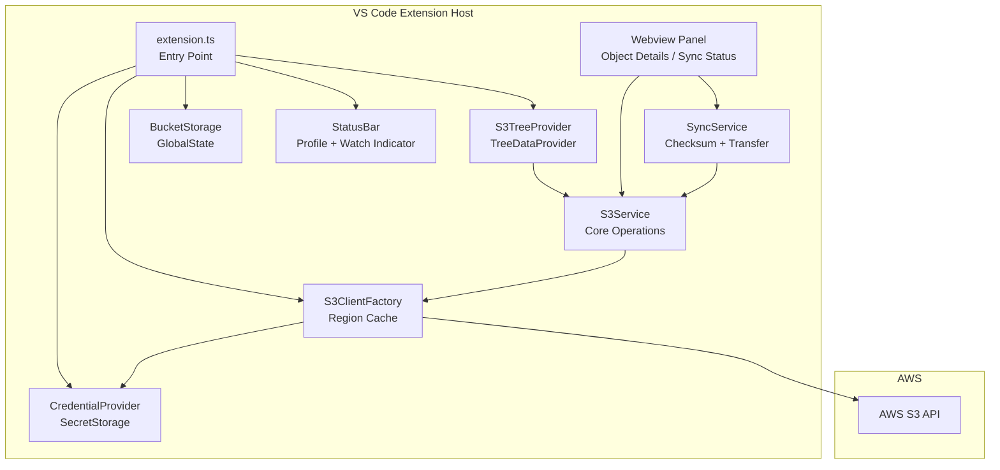

# Design Document: S3 Management Tool

## Overview

The S3 Management Tool is a standalone VS Code extension that lets developers manage AWS S3 buckets and objects directly from the IDE. It follows the same architectural patterns as the existing SQS Management Tool: no backend server, AWS SDK v3 for direct API communication, VS Code SecretStorage for credentials, and a tree view as the primary navigation surface.

The key differentiator from a generic S3 browser is **permission-aware architecture**: the extension works for users who lack `s3:ListAllMyBuckets`, supports manual bucket addition by name/ARN/prefix, and enforces prefix-level access scoping for shared-bucket scenarios.

The UI follows the VS Code project explorer tree view pattern (buckets → prefixes → objects), with a webview panel opening on object click for metadata, preview, and operations. Sync functionality (local ↔ S3) is a first-class feature with profiles, watch mode, and bidirectional conflict detection.

---

## Architecture

The extension is a single Node.js process running inside VS Code. There is no backend server. All AWS communication happens via AWS SDK v3 clients instantiated inside the extension host process.



**Key architectural decisions:**

- **No backend server** — eliminates deployment complexity and keeps the extension self-contained (Requirement 1.2).
- **S3ClientFactory with region cache** — one S3 client per region, invalidated on credential change (Requirement 20.1, 20.4).
- **SecretStorage for credentials** — credentials never written to disk in plaintext, never passed to webview (Requirement 2.1, 2.6).
- **GlobalState for bucket/sync configs** — persisted across VS Code sessions without a database (Requirement 1.5).
- **Webview panel for rich detail** — object metadata, upload progress, sync status rendered in a sandboxed HTML panel; credentials are never included in postMessage payloads.
- **SyncService as a pure service** — no VS Code UI dependencies, making it independently testable.

---

## Components and Interfaces

### extension.ts — Entry Point

Activates on `onView:s3ManagementBuckets`. Initializes all services, registers the tree view, registers all commands, creates the status bar items, and wires up the webview message handler.

```typescript
export async function activate(context: vscode.ExtensionContext): Promise<void>
export function deactivate(): void
```

### S3ClientFactory

Creates and caches one `S3Client` per AWS region. On credential update, disposes all cached clients and recreates them with new credentials.

```typescript
interface IS3ClientFactory {
  getClient(region: string): S3Client;
  updateCredentials(credentials: AwsCredentials): void;
  dispose(): void;
}
```

### CredentialProvider

Identical priority chain to the SQS tool: env vars → AWS profile → SecretStorage → IAM role. Exposes `storeCredentials`, `clearCredentials`, `listProfiles`, `getCredentials`.

```typescript
interface ICredentialProvider {
  getCredentials(profile?: string): Promise<AwsCredentials>;
  storeCredentials(credentials: AwsCredentials): Promise<void>;
  clearCredentials(): Promise<void>;
  listProfiles(): Promise<string[]>;
}
```

### S3Service

Wraps all AWS S3 API calls. Implements exponential backoff retry for `ThrottlingException` and `ServiceUnavailable` (max 3 retries). Never exposes raw SDK errors to callers — wraps them in human-readable `S3ToolError`.

```typescript
interface IS3Service {
  // Discovery
  tryListBuckets(): Promise<{ buckets: BucketSummary[]; hasPermission: boolean }>;
  validateBucketAccess(bucket: string, prefix?: string): Promise<ValidationResult>;

  // Bucket metadata
  getBucketRegion(bucket: string): Promise<string>;
  getBucketVersioning(bucket: string): Promise<VersioningStatus>;
  getBucketPolicy(bucket: string): Promise<string | null>;

  // Object listing
  listObjects(bucket: string, prefix: string, continuationToken?: string): Promise<ListObjectsPage>;

  // Object operations
  getObject(bucket: string, key: string): Promise<NodeJS.ReadableStream>;
  putObject(bucket: string, key: string, body: Buffer | NodeJS.ReadableStream, contentType?: string): Promise<void>;
  putObjectMultipart(bucket: string, key: string, filePath: string, onProgress: ProgressCallback): Promise<string>;
  deleteObject(bucket: string, key: string): Promise<void>;
  copyObject(srcBucket: string, srcKey: string, dstBucket: string, dstKey: string): Promise<void>;
  headObject(bucket: string, key: string): Promise<ObjectMetadata>;
  getPresignedUrl(bucket: string, key: string, expirySeconds: number): Promise<string>;
}
```

### SyncService

Pure service with no VS Code UI dependencies. Handles checksum comparison, incremental sync, conflict detection, dry-run, exclude patterns, and watch mode debouncing.

```typescript
interface ISyncService {
  syncLocalToS3(options: SyncOptions, token: vscode.CancellationToken, onProgress: SyncProgressCallback): Promise<SyncResult>;
  syncS3ToLocal(options: SyncOptions, token: vscode.CancellationToken, onProgress: SyncProgressCallback): Promise<SyncResult>;
  syncBidirectional(options: SyncOptions, token: vscode.CancellationToken, onProgress: SyncProgressCallback): Promise<SyncResult>;
  computeLocalMd5(filePath: string): Promise<string>;
  normalizeEtag(etag: string): string;
  isMultipartEtag(etag: string): boolean;
  matchesExcludePattern(filePath: string, patterns: string[]): boolean;
}
```

### BucketStorage

Persists `BucketConfig` and `SyncProfile` records in VS Code `globalState`. Mirrors the `QueueStorage` pattern from the SQS tool.

```typescript
interface IBucketStorage {
  getBuckets(): Promise<BucketConfig[]>;
  addBucket(config: BucketConfig): Promise<void>;
  removeBucket(id: string): Promise<void>;
  getSyncProfiles(): Promise<SyncProfile[]>;
  addSyncProfile(profile: SyncProfile): Promise<void>;
  updateSyncProfile(id: string, updates: Partial<SyncProfile>): Promise<void>;
  deleteSyncProfile(id: string): Promise<void>;
}
```

### S3TreeProvider

Implements `vscode.TreeDataProvider<S3TreeItem>`. Renders a three-level hierarchy: bucket nodes → prefix/folder nodes → object nodes. Lazy-loads children on expand. Supports `refresh()` for individual nodes or the full tree.

```typescript
class S3TreeProvider implements vscode.TreeDataProvider<S3TreeItem> {
  refresh(item?: S3TreeItem): void;
  getTreeItem(element: S3TreeItem): vscode.TreeItem;
  getChildren(element?: S3TreeItem): Promise<S3TreeItem[]>;
}
```

Tree item types and their `contextValue` strings (used for context menu `when` clauses):

| Type | contextValue | Icon |
|------|-------------|------|
| Bucket | `s3Bucket` | `$(database)` |
| Prefix/Folder | `s3Prefix` | `$(folder)` |
| Object | `s3Object` | `$(file)` |
| Error node | `s3Error` | `$(error)` |

### Webview Panel

A single webview panel type (`s3ObjectDetails`) opened when the user clicks an object node. Receives object metadata via `postMessage` from the extension host. Sends operation requests (download, delete, copy, presigned URL, upload) back via `postMessage`. Credentials are never included in any message payload — the extension host performs all AWS calls.

---

## Data Models

```typescript
// Persisted in globalState
interface BucketConfig {
  id: string;               // UUID
  name: string;             // S3 bucket name
  region: string;           // AWS region
  prefix?: string;          // Optional prefix scope (always ends with '/')
  addedManually: boolean;
  createdAt: string;        // ISO 8601
  updatedAt: string;
}

// Persisted in globalState
interface SyncProfile {
  id: string;
  name: string;
  localPath: string;
  bucket: string;
  prefix?: string;
  region: string;
  direction: 'upload' | 'download' | 'bidirectional';
  deleteMissing: boolean;
  excludePatterns: string[];
  conflictStrategy: 'keep-local' | 'keep-remote' | 'keep-both' | 'skip';
  lastSyncAt?: string;      // ISO 8601, updated after each successful sync
  createdAt: string;
  updatedAt: string;
}

// In-memory only
interface SyncResult {
  startTime: string;
  endTime?: string;
  status: 'running' | 'completed' | 'cancelled' | 'failed';
  uploaded: number;
  downloaded: number;
  deleted: number;
  skipped: number;
  conflicts: number;
  errors: SyncError[];
}

interface SyncError {
  file: string;
  operation: 'upload' | 'download' | 'delete';
  error: string;
  timestamp: string;
}

interface ObjectMetadata {
  key: string;
  size: number;
  lastModified: Date;
  contentType?: string;
  etag: string;
  storageClass?: string;
  userMetadata: Record<string, string>;
}

interface ListObjectsPage {
  objects: ObjectSummary[];
  commonPrefixes: string[];
  nextContinuationToken?: string;
  isTruncated: boolean;
}

interface ObjectSummary {
  key: string;
  size: number;
  lastModified: Date;
  etag: string;
  storageClass?: string;
}
```

---

## Correctness Properties

*A property is a characteristic or behavior that should hold true across all valid executions of a system — essentially, a formal statement about what the system should do. Properties serve as the bridge between human-readable specifications and machine-verifiable correctness guarantees.*

### Property 1: Checksum round-trip — unchanged file is classified as skipped

*For any* local file that has been uploaded to S3 and then compared again (without modification), the `SyncService` should classify it as `skipped` (checksum match), not `uploaded`.

**Validates: Requirements 21.1, 21.2, 21.3**

---

### Property 2: ETag normalization strips quotes

*For any* ETag string returned by S3 (which may be wrapped in double-quotes), `normalizeEtag` should return the bare hex string without surrounding quotes, and the result should equal the MD5 hex of the corresponding file content.

**Validates: Requirements 21.2**

---

### Property 3: Multipart ETags are never compared as MD5

*For any* S3 object whose ETag contains a `-` suffix (multipart upload marker), `isMultipartEtag` should return `true`, and the sync decision should be `download` (not `skipped`), regardless of local file content.

**Validates: Requirements 21.4**

---

### Property 4: Prefix scope enforcement — no out-of-scope keys reach the API

*For any* `BucketConfig` with a non-empty `prefix`, and *for any* user-supplied object key, if the key does not begin with the configured prefix then `S3Service` should return an error and make zero AWS API calls.

**Validates: Requirements 18.1, 18.2, 18.3**

---

### Property 5: Bucket name validation rejects invalid names

*For any* string that violates S3 bucket naming rules (length outside 3–63, uppercase letters, starts/ends with hyphen, contains invalid characters), the validator should return invalid. *For any* string that satisfies all rules, the validator should return valid.

**Validates: Requirements 19.1**

---

### Property 6: ARN parsing round-trip

*For any* valid S3 ARN of the form `arn:aws:s3:::<bucket-name>`, parsing it should yield the correct bucket name, and re-formatting the parsed result should produce the original ARN string.

**Validates: Requirements 4.2, 19.2**

---

### Property 7: Exclude pattern filtering is consistent

*For any* set of file paths and *for any* glob exclude pattern, every path matched by the pattern should be excluded from the sync walk, and every path not matched should be included — with no path appearing in both sets.

**Validates: Requirements 13.7, 14.7**

---

### Property 8: Dry-run produces zero AWS mutations

*For any* sync configuration with `dryRun: true`, executing `syncLocalToS3` or `syncS3ToLocal` should result in zero calls to `putObject`, `deleteObject`, or `getObject` on the S3 service, while still returning a non-empty plan of files that would be transferred.

**Validates: Requirements 13.6, 14.6**

---

### Property 9: Conflict classification covers all cases

*For any* pair of (local file modification time, S3 object modification time, last sync timestamp), the classification result should be exactly one of: `local-only`, `remote-only`, `unchanged`, `local-newer`, `remote-newer`, or `conflicted` — never `undefined` and never two classifications simultaneously.

**Validates: Requirements 15.2**

---

### Property 10: Presigned URL expiry validation

*For any* expiry duration greater than 10080 minutes, URL generation should be rejected with a validation error. *For any* duration in the range [1, 10080], generation should succeed.

**Validates: Requirements 12.1, 12.4**

---

### Property 11: Object key UTF-8 length validation

*For any* object key string, the validator should reject it if and only if it contains a null byte or its UTF-8 byte length exceeds 1024.

**Validates: Requirements 19.3**

---

### Property 12: Prefix normalization is idempotent

*For any* prefix string, applying the normalization rule (append `/` if not empty and not already ending with `/`) twice should produce the same result as applying it once.

**Validates: Requirements 19.4**

---

## Error Handling

### AWS Error Classification

All AWS SDK errors are caught at the `S3Service` boundary and mapped to one of:

| Error class | Behavior |
|-------------|----------|
| `ThrottlingException`, `ServiceUnavailable` | Exponential backoff, max 3 retries (delays: 1s, 2s, 4s) |
| `AccessDenied`, `AccessDeniedException` | Return permission-denied result; never throw to UI |
| `NoSuchBucket`, `NoSuchKey` | Return not-found result |
| `NoSuchBucketPolicy` | Return `null` policy (not an error) |
| Credential expiry (`ExpiredTokenException`) | Notify user to re-configure credentials |
| All others | Wrap in `S3ToolError` with human-readable message; log full stack to output channel |

### Webview Security

- The extension host never includes `accessKeyId`, `secretAccessKey`, or `sessionToken` in any `postMessage` payload.
- All data sent to the webview passes through `sanitizeForWebview` (same pattern as SQS tool).
- The webview Content Security Policy disallows inline scripts and restricts `connect-src` to `https:`.

### Partial Failure in Sync

Sync operations use a "continue on error" strategy: individual file failures are recorded in `SyncResult.errors` and processing continues. The final `SyncResult.status` is `completed` if at least one file succeeded and some failed (a warning is shown), or `failed` if no files could be processed at all.

### Watch Mode Errors

Upload failures during watch mode show an error notification but do not stop the watcher. The watcher remains active for subsequent file change events.

---

## Testing Strategy

### Dual Testing Approach

Both unit tests and property-based tests are required. They are complementary:

- **Unit tests** cover specific examples, integration points, and error conditions.
- **Property-based tests** verify universal correctness across randomized inputs.

### Property-Based Testing Library

The extension is TypeScript/Node.js. The property-based testing library is **[fast-check](https://github.com/dubzzz/fast-check)**, which integrates with Jest (already used in the SQS tool).

Each property test runs a minimum of **100 iterations** (fast-check default is 100; set `numRuns: 100` explicitly).

Each property test is tagged with a comment in the format:
```
// Feature: s3-management-tool, Property N: <property text>
```

### Property Test Mapping

| Design Property | Test description |
|----------------|-----------------|
| Property 1 | Generate random file content, compute MD5, mock S3 ETag to match, assert sync classifies as `skipped` |
| Property 2 | Generate random hex strings with/without surrounding quotes, assert `normalizeEtag` strips quotes |
| Property 3 | Generate ETags with `-N` suffix, assert `isMultipartEtag` returns `true` and sync decision is `download` |
| Property 4 | Generate random bucket configs with prefix + random keys, assert out-of-scope keys never reach mock S3 client |
| Property 5 | Generate random strings, assert validator result matches S3 naming rules |
| Property 6 | Generate valid bucket names, construct ARN, parse, re-format, assert round-trip equality |
| Property 7 | Generate random file lists + glob patterns, assert partition is exhaustive and disjoint |
| Property 8 | Generate random local directories + S3 object lists, run dry-run sync, assert zero mock S3 mutations |
| Property 9 | Generate random (localMtime, remoteMtime, lastSyncAt) triples, assert classification is always exactly one value |
| Property 10 | Generate random integers, assert validation result matches `1 ≤ n ≤ 10080` |
| Property 11 | Generate random strings including null bytes and long strings, assert validator matches byte-length rule |
| Property 12 | Generate random prefix strings, assert `normalizePrefix(normalizePrefix(s)) === normalizePrefix(s)` |

### Unit Test Coverage

Unit tests (Jest) cover:

- `S3ClientFactory`: cache hit/miss, credential update clears cache
- `CredentialProvider`: priority chain, SecretStorage store/retrieve, profile listing
- `BucketStorage`: add/remove/duplicate detection, sync profile CRUD
- `S3Service`: `tryListBuckets` with `AccessDenied` returns empty list, `validateBucketAccess` success/failure, retry logic (mock 2 throttle errors then success)
- `SyncService`: `computeLocalMd5` against known fixture files, conflict classification examples, `deleteMissing` behavior
- Input validators: specific valid/invalid examples for bucket names, ARNs, object keys, prefixes
- Webview sanitizer: credential fields are stripped from postMessage payloads

### Integration / E2E Tests

E2E tests use **LocalStack** (same pattern as the SQS tool) to run against a real S3-compatible API:

- Full sync round-trip: upload directory → verify S3 objects → sync back → verify local files unchanged
- Incremental sync: modify one file → re-sync → verify only that file was re-uploaded
- Prefix enforcement: attempt operation outside prefix → verify rejection
- Watch mode: write file to watched directory → verify S3 upload within debounce window
