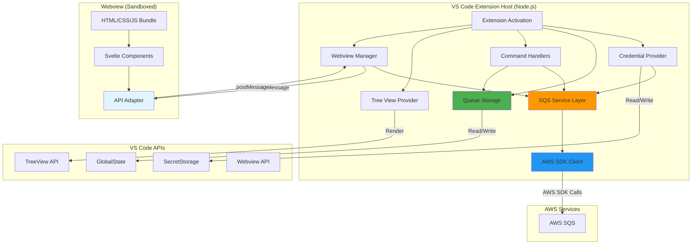
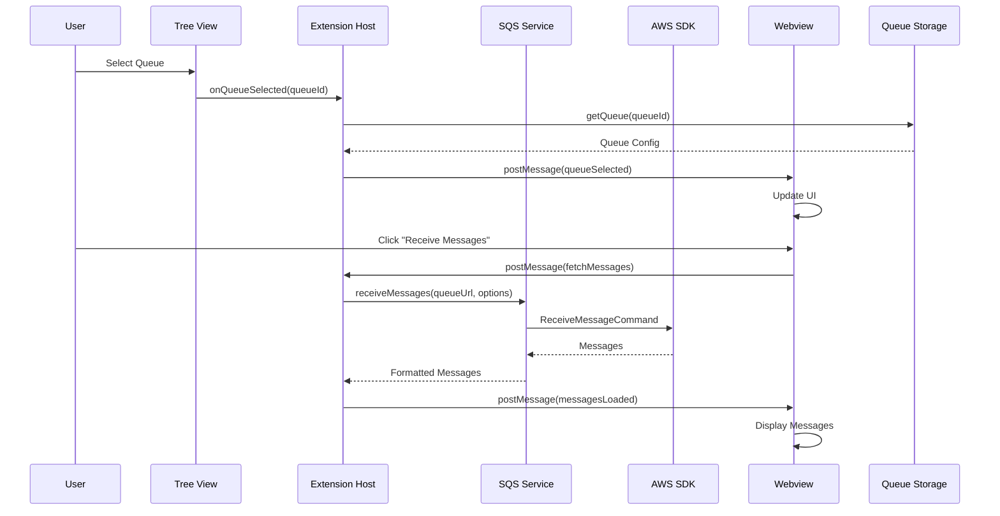
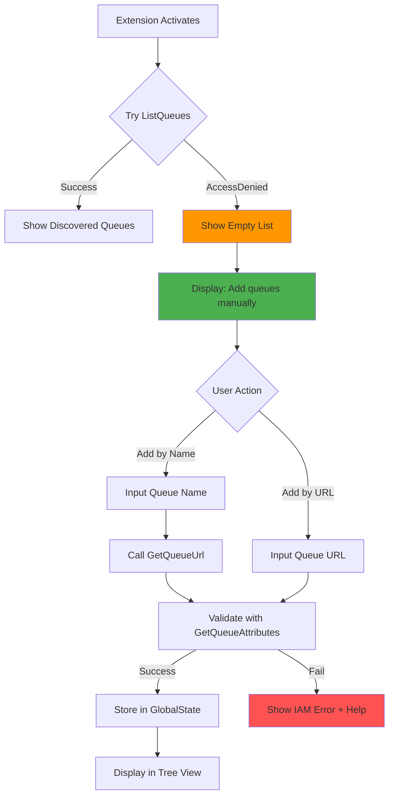
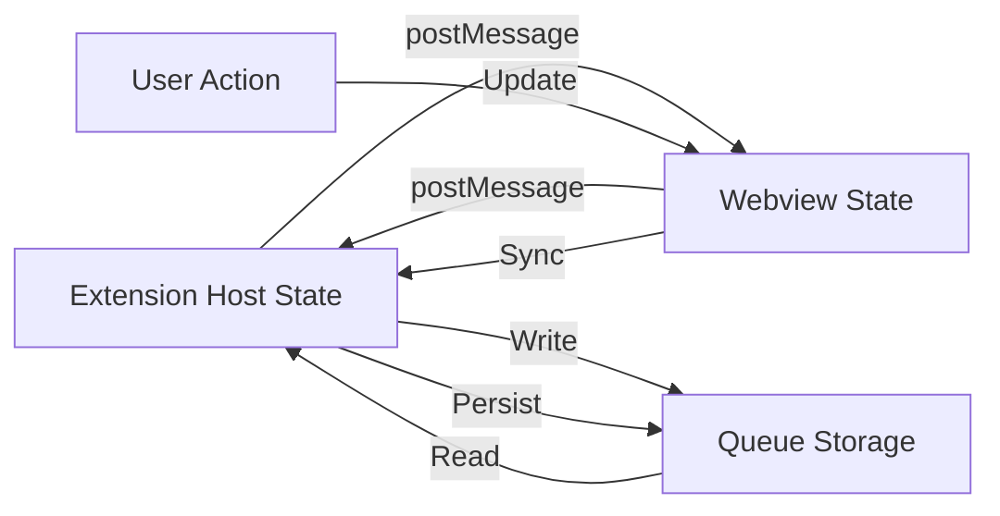

# Design Document: Standalone AWS SQS Extension

## Overview

This design transforms the VS Code SQS Management Tool from a backend-dependent architecture to a standalone extension that communicates directly with AWS SQS using the AWS SDK for JavaScript v3. The extension eliminates the need for the Spring Boot backend while maintaining feature parity and adding critical support for restrictive IAM environments.

### Key Design Goals

1. **Direct AWS Integration**: Replace HTTP API calls to backend with direct AWS SDK operations
2. **Restrictive IAM Support**: Work without `sqs:ListQueues` permission through manual queue entry
3. **Visual Management**: Provide rich UI for users without AWS Console access
4. **Secure Credentials**: Protect AWS credentials using VS Code SecretStorage
5. **Local Persistence**: Store queue configurations in VS Code GlobalState
6. **Feature Parity**: Replicate all backend functionality (QueueService, MessageService, RedriveService, ConfigurationService)

### Architecture Philosophy

The design follows a **layered architecture** with clear separation of concerns:

- **Extension Host Layer**: Node.js process with access to VS Code APIs and AWS SDK
- **Service Layer**: Business logic replicating backend services
- **Storage Layer**: VS Code GlobalState and SecretStorage for persistence
- **Webview Layer**: Sandboxed UI communicating via postMessage
- **AWS SDK Layer**: Direct communication with AWS SQS

This architecture ensures security (credentials never exposed to webview), testability (services can be unit tested), and maintainability (clear boundaries between layers).

## Project Structure

The standalone extension follows a clean, well-organized TypeScript project structure that mirrors the backend Spring Boot architecture while following VS Code extension best practices.

```
vscode-extension/sqs-management-tool/
├── src/
│   ├── services/                    # Service layer (replaces backend)
│   │   ├── sqs-service.ts          # Core SQS operations (QueueService + MessageService)
│   │   ├── redrive-service.ts      # DLQ redrive operations (RedriveService)
│   │   ├── queue-storage.ts        # Queue persistence (ConfigurationService)
│   │   └── credential-provider.ts  # AWS credential management
│   │
│   ├── aws/                         # AWS SDK integration
│   │   ├── client-factory.ts       # SQS client caching per region
│   │   └── retry-handler.ts        # Exponential backoff retry logic
│   │
│   ├── commands/                    # VS Code command handlers
│   │   ├── add-queue.ts            # Manual queue entry (by name/URL)
│   │   ├── remove-queue.ts         # Remove queue from storage
│   │   ├── refresh-queue.ts        # Refresh queue attributes
│   │   ├── select-profile.ts       # AWS profile selection
│   │   ├── export-queues.ts        # Export queue configurations
│   │   └── import-queues.ts        # Import queue configurations
│   │
│   ├── views/                       # VS Code UI components
│   │   ├── queue-tree-provider.ts  # Tree view for queue list
│   │   └── webview-manager.ts      # Webview lifecycle & postMessage
│   │
│   ├── utils/                       # Utility functions
│   │   ├── validation.ts           # Input validation (URL, queue name, etc.)
│   │   ├── error-handler.ts        # Error classification & user messages
│   │   ├── logger.ts               # Output channel logging
│   │   └── sanitizer.ts            # Credential sanitization for logs
│   │
│   ├── models/                      # TypeScript interfaces
│   │   ├── queue-config.ts         # QueueConfig interface
│   │   ├── message.ts              # Message interface
│   │   ├── credentials.ts          # AwsCredentials interface
│   │   └── errors.ts               # ExtensionError interface
│   │
│   ├── extension.ts                 # Main extension entry point (standalone)
│   ├── extension-svelte.ts          # Current bundled Svelte version (keep for migration)
│   └── api.ts                       # Legacy HTTP API (will be removed)
│
├── tests/                           # Test suite
│   ├── unit/                        # Unit tests
│   │   ├── services/
│   │   │   ├── sqs-service.test.ts
│   │   │   ├── credential-provider.test.ts
│   │   │   └── queue-storage.test.ts
│   │   ├── commands/
│   │   │   ├── add-queue.test.ts
│   │   │   └── remove-queue.test.ts
│   │   └── utils/
│   │       ├── validation.test.ts
│   │       └── error-handler.test.ts
│   │
│   ├── integration/                 # Integration tests
│   │   ├── localstack/
│   │   │   ├── message-operations.test.ts
│   │   │   ├── redrive-operations.test.ts
│   │   │   └── queue-discovery.test.ts
│   │   └── webview/
│   │       └── postmessage.test.ts
│   │
│   ├── property/                    # Property-based tests
│   │   ├── queue-storage.property.test.ts
│   │   ├── message-operations.property.test.ts
│   │   ├── validation.property.test.ts
│   │   └── credentials.property.test.ts
│   │
│   └── fixtures/                    # Test fixtures
│       ├── mock-queues.json
│       └── mock-messages.json
│
├── media/                           # Webview assets (existing Svelte bundle)
│   ├── bundle.js                    # Bundled Svelte app
│   ├── bundle.js.map
│   └── sqs-management-tool-frontend.css
│
├── docs/                            # Documentation
│   ├── ARCHITECTURE.md              # Architecture overview
│   ├── STANDALONE_EXTENSION_PLAN.md # Implementation plan
│   ├── IAM_PERMISSIONS.md           # Minimal IAM permissions guide
│   ├── TROUBLESHOOTING.md           # Common issues and solutions
│   └── MANUAL_QUEUE_ENTRY.md        # Guide for restrictive IAM environments
│
├── .vscode/                         # VS Code workspace settings
│   ├── launch.json                  # Debug configurations
│   └── tasks.json                   # Build tasks
│
├── package.json                     # Extension manifest & dependencies
├── tsconfig.json                    # TypeScript configuration
├── .gitignore
├── .eslintrc.json                   # ESLint configuration
├── jest.config.js                   # Jest test configuration
├── docker-compose.yml               # LocalStack for integration tests
└── README.md                        # User-facing documentation
```

### Structure Design Decisions

**Service Layer (`services/`)**
- Replicates backend Spring Boot services for familiarity
- `sqs-service.ts` combines QueueService + MessageService (closely related operations)
- `redrive-service.ts` handles DLQ operations separately for clarity
- `queue-storage.ts` replaces ConfigurationService using VS Code GlobalState
- `credential-provider.ts` manages AWS credentials (new functionality)

**AWS SDK Abstraction (`aws/`)**
- `client-factory.ts`: Caches SQS clients per region for performance
- `retry-handler.ts`: Implements exponential backoff for reliability

**Command Pattern (`commands/`)**
- Each VS Code command in its own file for clear separation
- Easy to test and maintain
- Simple command registration in extension.ts

**Dual Entry Points**
- `extension.ts`: New standalone version (AWS SDK)
- `extension-svelte.ts`: Current backend-dependent version
- Allows gradual migration and A/B testing

**Comprehensive Testing**
- Unit tests: Specific examples and edge cases
- Integration tests: End-to-end with LocalStack
- Property tests: Universal correctness (28 properties from design)

**Webview Reuse**
- Existing Svelte bundle in `media/` can be reused
- Already has postMessage communication
- Minimal changes needed to adapt from HTTP API

### Migration Strategy

**Phase 1: Parallel Development**
- Keep `extension-svelte.ts` (current version)
- Build `extension.ts` (standalone version)
- Both coexist during development

**Phase 2: Feature Flag**
```json
{
  "contributes": {
    "configuration": {
      "properties": {
        "sqsManagementTool.useStandaloneMode": {
          "type": "boolean",
          "default": false,
          "description": "Use standalone mode (no backend required)"
        }
      }
    }
  }
}
```

**Phase 3: Gradual Rollout**
1. Beta users test standalone mode
2. Collect feedback and fix issues
3. Make standalone mode default
4. Remove backend-dependent code

### Dependencies

**Production Dependencies:**
```json
{
  "dependencies": {
    "@aws-sdk/client-sqs": "^3.x.x",
    "@aws-sdk/client-sts": "^3.x.x",
    "@aws-sdk/credential-providers": "^3.x.x"
  }
}
```

**Development Dependencies:**
```json
{
  "devDependencies": {
    "jest": "^29.x.x",
    "@types/jest": "^29.x.x",
    "fast-check": "^3.x.x",
    "@testcontainers/localstack": "^10.x.x"
  }
}
```

### Benefits

✅ **Clear separation**: Services, commands, views, utils in dedicated directories
✅ **Backend parity**: Service layer mirrors Spring Boot structure for familiarity
✅ **Testable**: Each component can be unit tested independently
✅ **Scalable**: Easy to add new commands or services
✅ **Maintainable**: Clear file organization and consistent naming
✅ **Gradual migration**: Can coexist with current version during transition
✅ **Reuses existing work**: Svelte bundle stays the same with minimal changes

## Architecture

### High-Level Architecture




### Component Interaction Flow



### Restrictive IAM Support Flow



## Components and Interfaces

### 1. SQS Service Layer

Replicates backend QueueService, MessageService, and RedriveService functionality.

**Interface:**
```typescript
interface ISQSService {
  // Queue Operations (QueueService equivalent)
  tryListQueues(): Promise<ListQueuesResult>;
  getQueueUrl(queueName: string, accountId?: string): Promise<string>;
  getQueueAttributes(queueUrl: string): Promise<QueueAttributes>;
  validateQueueAccess(queueUrl: string): Promise<ValidationResult>;
  extractDlqFromAttributes(attributes: QueueAttributes): DlqInfo | null;
  extractQueueName(queueUrl: string): string;
  
  // Message Operations (MessageService equivalent)
  receiveMessages(queueUrl: string, options: ReceiveOptions): Promise<Message[]>;
  sendMessage(queueUrl: string, body: string, options: SendOptions): Promise<SendResult>;
  deleteMessage(queueUrl: string, receiptHandle: string): Promise<void>;
  changeMessageVisibility(queueUrl: string, receiptHandle: string, timeout: number): Promise<void>;
  purgeQueue(queueUrl: string): Promise<void>;
  
  // Redrive Operations (RedriveService equivalent)
  redriveMessages(dlqUrl: string, mainQueueUrl: string, options: RedriveOptions): Promise<RedriveResult>;
  redriveSelectedMessages(dlqUrl: string, mainQueueUrl: string, messages: Message[]): Promise<RedriveResult>;
}

interface ListQueuesResult {
  queues: string[];
  hasPermission: boolean;
}

interface ValidationResult {
  valid: boolean;
  error?: string;
  requiredPermissions?: string[];
}

interface QueueAttributes {
  [key: string]: string;
}

interface DlqInfo {
  dlqUrl: string;
  dlqName: string;
  maxReceiveCount: number;
}

interface ReceiveOptions {
  maxMessages: number;
  visibilityTimeout: number;
  waitTimeSeconds: number;
}

interface SendOptions {
  delaySeconds?: number;
  messageAttributes?: Record<string, MessageAttributeValue>;
}

interface Message {
  messageId: string;
  body: string;
  receiptHandle: string;
  attributes: Record<string, string>;
  messageAttributes: Record<string, MessageAttributeValue>;
}

interface RedriveOptions {
  maxMessages: number;
  redriveAll: boolean;
}

interface RedriveResult {
  processedCount: number;
  successCount: number;
  failureCount: number;
  succeeded: string[];
  failed: Array<{ messageId: string; error: string }>;
}
```

**Implementation Strategy:**
- Wrap AWS SDK commands with error handling and retry logic
- Cache SQS client instances per region
- Implement exponential backoff for transient errors
- Gracefully handle AccessDeniedException for ListQueues
- Validate inputs before making AWS API calls
- Transform AWS SDK responses to match backend API format


### 2. Credential Provider

Manages AWS credential loading from multiple sources with priority chain.

**Interface:**
```typescript
interface ICredentialProvider {
  getCredentials(profile?: string): Promise<AwsCredentials>;
  listProfiles(): Promise<string[]>;
  validateCredentials(credentials: AwsCredentials): Promise<boolean>;
  storeCredentials(credentials: AwsCredentials): Promise<void>;
  clearCredentials(): Promise<void>;
}

interface AwsCredentials {
  accessKeyId: string;
  secretAccessKey: string;
  sessionToken?: string;
}
```

**Credential Priority Chain:**
1. Environment variables (AWS_ACCESS_KEY_ID, AWS_SECRET_ACCESS_KEY)
2. AWS profile from ~/.aws/credentials
3. VS Code SecretStorage
4. IAM role (EC2/ECS metadata)
5. Manual user input (stored in SecretStorage)

**Implementation Strategy:**
- Use @aws-sdk/credential-providers for profile and IAM role loading
- Store manually entered credentials in VS Code SecretStorage (encrypted)
- Validate credentials using STS GetCallerIdentity
- Never log credentials to Output panel or Debug Console
- Provide clear error messages for credential issues

### 3. Queue Storage Service

Replicates backend ConfigurationService functionality using VS Code storage APIs.

**Interface:**
```typescript
interface IQueueStorage {
  // CRUD Operations
  getQueues(): Promise<QueueConfig[]>;
  getQueue(id: string): Promise<QueueConfig | null>;
  addQueue(queue: QueueConfig): Promise<void>;
  updateQueue(id: string, updates: Partial<QueueConfig>): Promise<void>;
  removeQueue(id: string): Promise<void>;
  
  // Bulk Operations
  importQueues(queues: QueueConfig[]): Promise<void>;
  exportQueues(): Promise<QueueConfig[]>;
  
  // Search and Filter
  searchQueues(query: string): Promise<QueueConfig[]>;
  getQueuesByRegion(region: string): Promise<QueueConfig[]>;
  getFavoriteQueues(): Promise<QueueConfig[]>;
  
  // Workspace Support
  useWorkspaceStorage(enabled: boolean): void;
}

interface QueueConfig {
  id: string;
  name: string;
  url: string;
  region: string;
  dlqUrl?: string;
  dlqName?: string;
  attributes?: QueueAttributes;
  addedManually: boolean;
  favorite?: boolean;
  tags?: string[];
  createdAt: string;
  updatedAt: string;
}
```

**Storage Strategy:**
- Use GlobalState for global queue list (persists across workspaces)
- Use WorkspaceState for workspace-specific queue lists
- Store as JSON with schema version for migration support
- Limit to 1000 queues to prevent performance issues
- Implement backup before destructive operations

### 4. Tree View Provider

Displays queues in VS Code Explorer sidebar with context menu actions.

**Interface:**
```typescript
interface IQueueTreeProvider extends vscode.TreeDataProvider<QueueTreeItem> {
  refresh(): void;
  getTreeItem(element: QueueTreeItem): vscode.TreeItem;
  getChildren(element?: QueueTreeItem): Promise<QueueTreeItem[]>;
}

interface QueueTreeItem {
  id: string;
  label: string;
  description: string;
  iconPath: vscode.ThemeIcon;
  contextValue: string;
  queue: QueueConfig;
}
```

**Tree Structure:**
```
📁 AWS SQS Queues
  📁 us-east-1
    📬 my-queue (Standard)
    📬 my-queue.fifo (FIFO)
    ☠️ my-dlq (DLQ)
  📁 us-west-2
    📬 another-queue (Standard)
```

**Context Menu Actions:**
- Refresh Attributes
- Copy Queue URL
- Copy Queue ARN
- Remove Queue
- Toggle Favorite
- Add Tags

### 5. Webview Manager

Manages webview lifecycle and postMessage communication.

**Interface:**
```typescript
interface IWebviewManager {
  createOrShowWebview(queue: QueueConfig): void;
  sendMessage(command: string, data: any): void;
  handleMessage(message: WebviewMessage): Promise<void>;
  dispose(): void;
}

interface WebviewMessage {
  command: string;
  [key: string]: any;
}
```

**Supported Commands:**

Extension Host → Webview:
- `queueSelected`: Queue was selected in tree view
- `messagesLoaded`: Messages received from SQS
- `messageSent`: Message sent successfully
- `messageDeleted`: Message deleted successfully
- `queuePurged`: Queue purged successfully
- `redriveResult`: Redrive operation completed
- `error`: Operation failed

Webview → Extension Host:
- `fetchMessages`: Receive messages from queue
- `sendMessage`: Send message to queue
- `deleteMessage`: Delete message from queue
- `changeVisibility`: Change message visibility timeout
- `purgeQueue`: Purge all messages from queue
- `redriveMessages`: Redrive messages from DLQ
- `refreshAttributes`: Refresh queue attributes

### 6. Command Handlers

Registers VS Code commands for user actions.

**Commands:**
```typescript
interface ICommandRegistry {
  registerCommands(context: vscode.ExtensionContext): void;
}
```

**Command List:**
- `sqs-management-tool.addQueue`: Add queue manually
- `sqs-management-tool.addQueueByName`: Add queue by name
- `sqs-management-tool.addQueueByUrl`: Add queue by URL
- `sqs-management-tool.removeQueue`: Remove queue from list
- `sqs-management-tool.refreshQueue`: Refresh queue attributes
- `sqs-management-tool.selectProfile`: Select AWS profile
- `sqs-management-tool.refreshQueues`: Refresh all queues
- `sqs-management-tool.exportQueues`: Export queue configurations
- `sqs-management-tool.importQueues`: Import queue configurations
- `sqs-management-tool.tryAutoDiscover`: Try auto-discovering queues


## Data Models

### Queue Configuration Model

```typescript
interface QueueConfig {
  // Identity
  id: string;                    // UUID
  name: string;                  // Queue name (e.g., "my-queue")
  url: string;                   // Full queue URL
  region: string;                // AWS region (e.g., "us-east-1")
  
  // Dead Letter Queue
  dlqUrl?: string;               // DLQ URL if configured
  dlqName?: string;              // DLQ name
  
  // Attributes (cached from GetQueueAttributes)
  attributes?: {
    ApproximateNumberOfMessages?: string;
    ApproximateNumberOfMessagesNotVisible?: string;
    ApproximateNumberOfMessagesDelayed?: string;
    MessageRetentionPeriod?: string;
    VisibilityTimeout?: string;
    DelaySeconds?: string;
    ReceiveMessageWaitTimeSeconds?: string;
    QueueArn?: string;
    CreatedTimestamp?: string;
    LastModifiedTimestamp?: string;
    RedrivePolicy?: string;
  };
  
  // Metadata
  addedManually: boolean;        // True if added manually (not auto-discovered)
  favorite?: boolean;            // User-marked favorite
  tags?: string[];               // User-defined tags
  createdAt: string;             // ISO timestamp
  updatedAt: string;             // ISO timestamp
}
```

### Message Model

```typescript
interface Message {
  messageId: string;
  body: string;
  receiptHandle: string;
  md5OfBody?: string;
  
  // System Attributes
  attributes: {
    SenderId?: string;
    SentTimestamp?: string;
    ApproximateReceiveCount?: string;
    ApproximateFirstReceiveTimestamp?: string;
  };
  
  // Message Attributes (custom)
  messageAttributes: Record<string, MessageAttributeValue>;
}

interface MessageAttributeValue {
  StringValue?: string;
  BinaryValue?: Uint8Array;
  DataType: string;
}
```

### Credential Model

```typescript
interface AwsCredentials {
  accessKeyId: string;
  secretAccessKey: string;
  sessionToken?: string;
}

interface AwsProfile {
  name: string;
  region?: string;
  credentials: AwsCredentials;
}
```

### Storage Schema

**GlobalState Schema:**
```json
{
  "queues": [
    {
      "id": "uuid-1",
      "name": "my-queue",
      "url": "https://sqs.us-east-1.amazonaws.com/123456789012/my-queue",
      "region": "us-east-1",
      "addedManually": true,
      "favorite": false,
      "tags": ["production", "orders"],
      "createdAt": "2024-01-01T00:00:00Z",
      "updatedAt": "2024-01-01T00:00:00Z"
    }
  ],
  "selectedProfile": "default",
  "schemaVersion": "1.0.0"
}
```

**SecretStorage Keys:**
- `aws-access-key-id`: AWS access key ID
- `aws-secret-access-key`: AWS secret access key
- `aws-session-token`: AWS session token (optional)

### Error Model

```typescript
interface ExtensionError {
  code: string;
  message: string;
  details?: string;
  requiredPermissions?: string[];
  troubleshootingUrl?: string;
}

// Error Codes
enum ErrorCode {
  ACCESS_DENIED = 'ACCESS_DENIED',
  QUEUE_NOT_FOUND = 'QUEUE_NOT_FOUND',
  INVALID_CREDENTIALS = 'INVALID_CREDENTIALS',
  NETWORK_ERROR = 'NETWORK_ERROR',
  THROTTLING = 'THROTTLING',
  VALIDATION_ERROR = 'VALIDATION_ERROR',
  PURGE_IN_PROGRESS = 'PURGE_IN_PROGRESS',
}
```

## Communication Patterns

### postMessage Protocol

The extension uses a request-response pattern for webview communication:

**Request Format:**
```typescript
interface WebviewRequest {
  command: string;
  requestId: string;  // UUID for matching responses
  [key: string]: any;
}
```

**Response Format:**
```typescript
interface WebviewResponse {
  command: string;
  requestId: string;  // Matches request
  success: boolean;
  data?: any;
  error?: ExtensionError;
}
```

**Example Flow:**
```typescript
// Webview sends request
vscode.postMessage({
  command: 'fetchMessages',
  requestId: 'req-123',
  queueUrl: 'https://...',
  maxMessages: 10
});

// Extension Host sends response
panel.webview.postMessage({
  command: 'messagesLoaded',
  requestId: 'req-123',
  success: true,
  data: { messages: [...] }
});
```

### API Adapter Pattern

The webview uses an API adapter to convert postMessage into Promise-based API:

```typescript
class ApiAdapter {
  private pendingRequests = new Map<string, { resolve, reject }>();
  
  async receiveMessages(queueUrl: string, options: ReceiveOptions): Promise<Message[]> {
    const requestId = crypto.randomUUID();
    
    return new Promise((resolve, reject) => {
      this.pendingRequests.set(requestId, { resolve, reject });
      
      vscode.postMessage({
        command: 'fetchMessages',
        requestId,
        queueUrl,
        ...options
      });
      
      // Timeout after 30 seconds
      setTimeout(() => {
        if (this.pendingRequests.has(requestId)) {
          this.pendingRequests.delete(requestId);
          reject(new Error('Request timeout'));
        }
      }, 30000);
    });
  }
  
  handleResponse(response: WebviewResponse) {
    const pending = this.pendingRequests.get(response.requestId);
    if (pending) {
      this.pendingRequests.delete(response.requestId);
      if (response.success) {
        pending.resolve(response.data);
      } else {
        pending.reject(response.error);
      }
    }
  }
}
```

### State Synchronization

The extension maintains state consistency between Extension Host and Webview:



**State Flow:**
1. User selects queue in Tree View
2. Extension Host loads queue config from storage
3. Extension Host sends `queueSelected` message to webview
4. Webview updates local state and UI
5. User performs action in webview
6. Webview sends command to Extension Host
7. Extension Host executes action and updates storage
8. Extension Host sends result back to webview
9. Webview updates UI


## Correctness Properties

A property is a characteristic or behavior that should hold true across all valid executions of a system—essentially, a formal statement about what the system should do. Properties serve as the bridge between human-readable specifications and machine-verifiable correctness guarantees.

### Property 1: AWS SDK Error Transformation

For any AWS SDK error, the extension should transform it into a user-friendly error message with actionable information.

**Validates: Requirements 1.4**

### Property 2: SQS Client Caching by Region

For any region, requesting an SQS client multiple times should return the same cached instance.

**Validates: Requirements 1.5**

### Property 3: Region Change Creates New Client

For any two different regions, the SQS client for region A should be different from the SQS client for region B.

**Validates: Requirements 1.6**

### Property 4: Retry with Exponential Backoff

For any transient AWS error, the service should retry the operation with exponentially increasing delays between attempts.

**Validates: Requirements 1.7**

### Property 5: Queue URL Format Validation

For any string, it should be accepted as a queue URL if and only if it matches the AWS SQS URL format pattern: `https://sqs.{region}.amazonaws.com/{account-id}/{queue-name}`.

**Validates: Requirements 2.7**

### Property 6: Manual Queue Persistence Round-Trip

For any queue added manually, after storing it and reloading from storage, the queue configuration should be identical.

**Validates: Requirements 2.10**

### Property 7: Credential Storage Round-Trip

For any AWS credentials entered manually, after storing them in SecretStorage and retrieving them, the credentials should be identical.

**Validates: Requirements 3.7**

### Property 8: Queue Configuration Field Preservation

For any queue configuration with all fields populated (id, name, url, region, dlqUrl, dlqName, attributes, addedManually, favorite, tags), after storing and retrieving it, all fields should be preserved exactly.

**Validates: Requirements 4.2**

### Property 9: Queue Storage Activation Round-Trip

For any set of queues stored in GlobalState, after extension deactivation and reactivation, all queues should be loaded with identical configurations.

**Validates: Requirements 4.3**

### Property 10: Export-Import Round-Trip

For any set of queue configurations, exporting to JSON and then importing should result in identical queue configurations.

**Validates: Requirements 4.8**

### Property 11: Queue ID Uniqueness

For any set of queues added to storage, all queue IDs should be unique (no duplicates).

**Validates: Requirements 4.9**

### Property 12: Queue Removal Persistence

For any queue in storage, after removing it, the queue should not be present in storage and should not appear in subsequent retrievals.

**Validates: Requirements 4.10**

### Property 13: RedrivePolicy Parsing

For any valid RedrivePolicy JSON string containing a deadLetterTargetArn, the extractDlqFromAttributes method should correctly extract the DLQ URL and maxReceiveCount.

**Validates: Requirements 5.7**

### Property 14: Received Messages Have Required Fields

For any messages received from SQS, each message should contain all required fields: messageId, body, receiptHandle, attributes, and messageAttributes.

**Validates: Requirements 6.3**

### Property 15: Send Message Returns ID

For any message sent to a queue, the sendMessage operation should return a non-empty messageId.

**Validates: Requirements 6.5**

### Property 16: Visibility Timeout Validation

For any visibility timeout value less than 0 or greater than 43200, the changeMessageVisibility method should reject it with an error.

**Validates: Requirements 6.9**

### Property 17: Redrive Preserves Message Attributes

For any message redriven from DLQ to main queue, all original message attributes should be preserved in the main queue.

**Validates: Requirements 7.3**

### Property 18: Successful Redrive Removes from DLQ

For any message successfully redriven to the main queue, the message should no longer exist in the DLQ.

**Validates: Requirements 7.4**

### Property 19: Redrive Result Completeness

For any redrive operation, the result should contain processedCount, successCount, failureCount, succeeded array, and failed array, where processedCount = successCount + failureCount.

**Validates: Requirements 7.6**

### Property 20: Selective Redrive Only Moves Specified Messages

For any subset of messages in a DLQ, calling redriveSelectedMessages should only move the specified messages, leaving other DLQ messages untouched.

**Validates: Requirements 7.8**

### Property 21: ARN to URL Conversion

For any valid SQS queue ARN in the format `arn:aws:sqs:{region}:{account}:{queue-name}`, the conversion to URL should produce `https://sqs.{region}.amazonaws.com/{account}/{queue-name}`.

**Validates: Requirements 8.6**

### Property 22: Queue Name Extraction from URL

For any valid SQS queue URL, extracting the queue name should return the last path segment of the URL.

**Validates: Requirements 8.7**

### Property 23: Error Logging

For any error that occurs during extension operations, the error should be logged to the VS Code Output panel.

**Validates: Requirements 10.6**

### Property 24: Input Validation Before API Calls

For any user input used in AWS API calls, validation should occur before the API call is made, not after.

**Validates: Requirements 10.9**

### Property 25: Validation Error Messages Include Rule

For any validation failure, the error message should include the specific validation rule that was violated.

**Validates: Requirements 10.10**

### Property 26: Credentials Never in Logs

For any log output to the Output panel or Debug Console, the log should not contain AWS access keys or secret keys.

**Validates: Requirements 13.2**

### Property 27: Credentials Never in postMessage

For any postMessage sent from Extension Host to Webview, the message should not contain AWS credentials (accessKeyId, secretAccessKey, sessionToken).

**Validates: Requirements 13.3**

### Property 28: Queue URL Sanitization

For any user-provided queue URL, the URL should be validated and sanitized before being used in AWS API calls to prevent injection attacks.

**Validates: Requirements 13.5, 13.6**


## Error Handling

### Error Classification

The extension categorizes errors into distinct types for appropriate handling:

```typescript
enum ErrorCategory {
  PERMISSION = 'PERMISSION',      // IAM permission issues
  VALIDATION = 'VALIDATION',      // Input validation failures
  NETWORK = 'NETWORK',            // Network connectivity issues
  THROTTLING = 'THROTTLING',      // AWS rate limiting
  NOT_FOUND = 'NOT_FOUND',        // Resource not found
  CONFIGURATION = 'CONFIGURATION', // Configuration issues
  INTERNAL = 'INTERNAL'           // Internal extension errors
}
```

### Error Handling Strategy

**1. Permission Errors (AccessDeniedException)**

```typescript
// Graceful degradation for ListQueues
try {
  const queues = await sqsService.listQueues();
} catch (error) {
  if (error.name === 'AccessDeniedException') {
    // Don't throw - show helpful message instead
    vscode.window.showInformationMessage(
      'ListQueues permission not available. Add queues manually.',
      'Add Queue', 'Learn More'
    );
    return { queues: [], hasPermission: false };
  }
  throw error; // Re-throw other errors
}

// Specific permission errors
if (error.name === 'AccessDeniedException') {
  const requiredPermissions = extractRequiredPermissions(error);
  vscode.window.showErrorMessage(
    `Missing IAM permission: ${requiredPermissions.join(', ')}\n\n` +
    `See documentation for minimal IAM setup.`,
    'View Docs'
  );
}
```

**2. Validation Errors**

```typescript
// Validate before API calls
function validateQueueUrl(url: string): ValidationResult {
  if (!url) {
    return { valid: false, error: 'Queue URL is required' };
  }
  
  const pattern = /^https:\/\/sqs\.[a-z0-9-]+\.amazonaws\.com\/\d+\/[a-zA-Z0-9_-]+$/;
  if (!pattern.test(url)) {
    return {
      valid: false,
      error: 'Invalid queue URL format. Expected: https://sqs.{region}.amazonaws.com/{account}/{queue-name}'
    };
  }
  
  return { valid: true };
}

// Use validation
const validation = validateQueueUrl(userInput);
if (!validation.valid) {
  vscode.window.showErrorMessage(validation.error);
  return;
}
```

**3. Network Errors**

```typescript
// Detect network errors
if (error.code === 'ENOTFOUND' || error.code === 'ETIMEDOUT') {
  vscode.window.showErrorMessage(
    'Network error: Unable to reach AWS SQS.\n\n' +
    'Please check your internet connection and try again.',
    'Retry'
  );
}
```

**4. Throttling Errors (Exponential Backoff)**

```typescript
async function executeWithRetry<T>(
  operation: () => Promise<T>,
  maxRetries: number = 3
): Promise<T> {
  let lastError: Error;
  
  for (let attempt = 0; attempt <= maxRetries; attempt++) {
    try {
      return await operation();
    } catch (error: any) {
      lastError = error;
      
      // Only retry on throttling or transient errors
      if (error.name === 'ThrottlingException' || 
          error.name === 'ServiceUnavailable' ||
          error.code === 'ETIMEDOUT') {
        
        if (attempt < maxRetries) {
          const delay = Math.pow(2, attempt) * 1000; // Exponential backoff
          await sleep(delay);
          continue;
        }
      }
      
      // Don't retry other errors
      throw error;
    }
  }
  
  throw lastError!;
}
```

**5. Resource Not Found Errors**

```typescript
if (error.name === 'QueueDoesNotExist' || error.code === 'AWS.SimpleQueueService.NonExistentQueue') {
  vscode.window.showErrorMessage(
    `Queue not found: ${queueName}\n\n` +
    `Please check:\n` +
    `- Queue name is correct\n` +
    `- Queue exists in region: ${region}\n` +
    `- You have access to the queue`,
    'Check Region', 'Retry'
  );
}
```

**6. Purge Errors**

```typescript
if (error.code === 'PurgeQueueInProgress') {
  vscode.window.showErrorMessage(
    'A purge operation is already in progress for this queue.\n\n' +
    'AWS allows only one purge per queue every 60 seconds. Please wait and try again.'
  );
}
```

### Error Logging

All errors are logged to the VS Code Output panel:

```typescript
class OutputLogger {
  private channel: vscode.OutputChannel;
  
  constructor() {
    this.channel = vscode.window.createOutputChannel('SQS Management Tool');
  }
  
  error(message: string, error?: Error) {
    const timestamp = new Date().toISOString();
    this.channel.appendLine(`[${timestamp}] ERROR: ${message}`);
    
    if (error) {
      this.channel.appendLine(`  Error: ${error.message}`);
      this.channel.appendLine(`  Stack: ${error.stack}`);
    }
  }
  
  warn(message: string) {
    const timestamp = new Date().toISOString();
    this.channel.appendLine(`[${timestamp}] WARN: ${message}`);
  }
  
  info(message: string) {
    const timestamp = new Date().toISOString();
    this.channel.appendLine(`[${timestamp}] INFO: ${message}`);
  }
}
```

### User-Friendly Error Messages

Error messages follow this template:

```
[What went wrong]

[Why it might have happened]

[What the user can do about it]
```

Example:
```
Failed to receive messages from queue "my-queue"

This might be because:
- You don't have sqs:ReceiveMessage permission
- The queue doesn't exist in this region
- Network connectivity issues

Try:
- Check your IAM permissions
- Verify the queue exists in region us-east-1
- Check your internet connection
```

### Error Recovery

The extension implements automatic recovery where possible:

1. **Credential Expiration**: Automatically refresh credentials when they expire
2. **Network Failures**: Retry with exponential backoff
3. **Throttling**: Automatically retry with backoff
4. **Stale Cache**: Refresh cached data on access errors

### Cancellation Support

Long-running operations support cancellation:

```typescript
async function redriveMessagesWithProgress(
  dlqUrl: string,
  mainQueueUrl: string,
  options: RedriveOptions
): Promise<RedriveResult> {
  return await vscode.window.withProgress({
    location: vscode.ProgressLocation.Notification,
    title: 'Redriving messages',
    cancellable: true
  }, async (progress, token) => {
    // Check cancellation before each batch
    if (token.isCancellationRequested) {
      throw new Error('Operation cancelled by user');
    }
    
    // Perform redrive with progress updates
    progress.report({ increment: 10, message: 'Processing batch 1...' });
    
    // Clean up on cancellation
    token.onCancellationRequested(() => {
      // Clean up resources
      logger.info('Redrive operation cancelled by user');
    });
    
    return result;
  });
}
```


## Testing Strategy

### Dual Testing Approach

The extension uses both unit tests and property-based tests for comprehensive coverage:

**Unit Tests**: Verify specific examples, edge cases, and error conditions
**Property Tests**: Verify universal properties across all inputs

Both are complementary and necessary. Unit tests catch concrete bugs, while property tests verify general correctness.

### Property-Based Testing

**Library**: fast-check (JavaScript/TypeScript property-based testing library)

**Configuration**: Each property test runs a minimum of 100 iterations to ensure comprehensive input coverage.

**Tagging**: Each property test references its design document property:
```typescript
// Feature: standalone-aws-sqs-extension, Property 5: Queue URL Format Validation
test('queue URL validation accepts only valid AWS SQS URLs', () => {
  fc.assert(
    fc.property(fc.string(), (url) => {
      const isValid = validateQueueUrl(url).valid;
      const matchesPattern = /^https:\/\/sqs\.[a-z0-9-]+\.amazonaws\.com\/\d+\/[a-zA-Z0-9_-]+$/.test(url);
      return isValid === matchesPattern;
    }),
    { numRuns: 100 }
  );
});
```

### Property Test Examples

**Property 6: Manual Queue Persistence Round-Trip**
```typescript
// Feature: standalone-aws-sqs-extension, Property 6: Manual Queue Persistence Round-Trip
test('manually added queues persist across storage round-trips', async () => {
  await fc.assert(
    fc.asyncProperty(
      fc.record({
        id: fc.uuid(),
        name: fc.string({ minLength: 1, maxLength: 80 }),
        url: fc.webUrl({ validSchemes: ['https'] }),
        region: fc.constantFrom('us-east-1', 'us-west-2', 'eu-west-1'),
        addedManually: fc.constant(true)
      }),
      async (queue) => {
        const storage = new QueueStorage(mockContext);
        await storage.addQueue(queue);
        const retrieved = await storage.getQueue(queue.id);
        expect(retrieved).toEqual(queue);
      }
    ),
    { numRuns: 100 }
  );
});
```

**Property 11: Queue ID Uniqueness**
```typescript
// Feature: standalone-aws-sqs-extension, Property 11: Queue ID Uniqueness
test('all queue IDs are unique', async () => {
  await fc.assert(
    fc.asyncProperty(
      fc.array(fc.record({
        name: fc.string({ minLength: 1 }),
        url: fc.webUrl({ validSchemes: ['https'] }),
        region: fc.string()
      }), { minLength: 2, maxLength: 50 }),
      async (queueInputs) => {
        const storage = new QueueStorage(mockContext);
        const ids: string[] = [];
        
        for (const input of queueInputs) {
          const queue = await storage.addQueue(input);
          ids.push(queue.id);
        }
        
        const uniqueIds = new Set(ids);
        expect(uniqueIds.size).toBe(ids.length);
      }
    ),
    { numRuns: 100 }
  );
});
```

**Property 17: Redrive Preserves Message Attributes**
```typescript
// Feature: standalone-aws-sqs-extension, Property 17: Redrive Preserves Message Attributes
test('redrive preserves all message attributes', async () => {
  await fc.assert(
    fc.asyncProperty(
      fc.record({
        messageId: fc.uuid(),
        body: fc.string(),
        attributes: fc.dictionary(fc.string(), fc.string()),
        messageAttributes: fc.dictionary(
          fc.string(),
          fc.record({
            StringValue: fc.string(),
            DataType: fc.constant('String')
          })
        )
      }),
      async (message) => {
        const service = new SQSService(mockClient);
        
        // Simulate redrive
        const result = await service.redriveSelectedMessages(
          dlqUrl,
          mainQueueUrl,
          [message]
        );
        
        // Verify attributes preserved
        const mainQueueMessages = await service.receiveMessages(mainQueueUrl, {
          maxMessages: 10,
          visibilityTimeout: 30,
          waitTimeSeconds: 0
        });
        
        const redrivenMessage = mainQueueMessages.find(m => m.messageId === message.messageId);
        expect(redrivenMessage?.messageAttributes).toEqual(message.messageAttributes);
      }
    ),
    { numRuns: 100 }
  );
});
```

### Unit Testing Strategy

**Test Organization:**
```
tests/
├── unit/
│   ├── services/
│   │   ├── sqs-service.test.ts
│   │   ├── credential-provider.test.ts
│   │   └── queue-storage.test.ts
│   ├── commands/
│   │   ├── add-queue.test.ts
│   │   └── remove-queue.test.ts
│   └── utils/
│       ├── validation.test.ts
│       └── error-handling.test.ts
├── integration/
│   ├── localstack/
│   │   ├── message-operations.test.ts
│   │   ├── redrive-operations.test.ts
│   │   └── queue-discovery.test.ts
│   └── webview/
│       └── postmessage-communication.test.ts
└── property/
    ├── queue-storage.property.test.ts
    ├── message-operations.property.test.ts
    └── validation.property.test.ts
```

**Unit Test Examples:**

```typescript
// Specific example: ListQueues graceful failure
describe('SQSService - Restrictive IAM Support', () => {
  test('tryListQueues returns hasPermission=false on AccessDenied', async () => {
    const mockClient = {
      send: jest.fn().mockRejectedValue({
        name: 'AccessDeniedException',
        message: 'User is not authorized to perform: sqs:ListQueues'
      })
    };
    
    const service = new SQSService(mockClient);
    const result = await service.tryListQueues();
    
    expect(result.hasPermission).toBe(false);
    expect(result.queues).toEqual([]);
  });
  
  test('tryListQueues throws on other errors', async () => {
    const mockClient = {
      send: jest.fn().mockRejectedValue(new Error('Network error'))
    };
    
    const service = new SQSService(mockClient);
    
    await expect(service.tryListQueues()).rejects.toThrow('Network error');
  });
});

// Edge case: Empty queue URL
describe('Queue URL Validation', () => {
  test('rejects empty queue URL', () => {
    const result = validateQueueUrl('');
    expect(result.valid).toBe(false);
    expect(result.error).toContain('required');
  });
  
  test('rejects malformed queue URL', () => {
    const result = validateQueueUrl('not-a-url');
    expect(result.valid).toBe(false);
    expect(result.error).toContain('Invalid queue URL format');
  });
  
  test('accepts valid queue URL', () => {
    const result = validateQueueUrl('https://sqs.us-east-1.amazonaws.com/123456789012/my-queue');
    expect(result.valid).toBe(true);
  });
});

// Error handling: Purge in progress
describe('SQSService - Purge Queue', () => {
  test('throws user-friendly error when purge in progress', async () => {
    const mockClient = {
      send: jest.fn().mockRejectedValue({
        code: 'PurgeQueueInProgress',
        message: 'Only one PurgeQueue operation on my-queue is allowed every 60 seconds'
      })
    };
    
    const service = new SQSService(mockClient);
    
    await expect(service.purgeQueue(queueUrl)).rejects.toThrow(
      'A purge operation is already in progress'
    );
  });
});
```

### Integration Testing with LocalStack

Use LocalStack to simulate AWS SQS for integration tests:

```typescript
describe('Integration: Message Operations', () => {
  let localstackClient: SQSClient;
  let service: SQSService;
  let queueUrl: string;
  
  beforeAll(async () => {
    // Start LocalStack container
    localstackClient = new SQSClient({
      endpoint: 'http://localhost:4566',
      region: 'us-east-1',
      credentials: {
        accessKeyId: 'test',
        secretAccessKey: 'test'
      }
    });
    
    service = new SQSService(localstackClient);
    
    // Create test queue
    const createResult = await localstackClient.send(
      new CreateQueueCommand({ QueueName: 'test-queue' })
    );
    queueUrl = createResult.QueueUrl!;
  });
  
  test('send and receive message round-trip', async () => {
    const messageBody = 'Test message';
    
    // Send message
    const sendResult = await service.sendMessage(queueUrl, messageBody, {});
    expect(sendResult.messageId).toBeDefined();
    
    // Receive message
    const messages = await service.receiveMessages(queueUrl, {
      maxMessages: 1,
      visibilityTimeout: 30,
      waitTimeSeconds: 0
    });
    
    expect(messages).toHaveLength(1);
    expect(messages[0].body).toBe(messageBody);
    expect(messages[0].messageId).toBe(sendResult.messageId);
  });
  
  afterAll(async () => {
    // Clean up
    await localstackClient.send(new DeleteQueueCommand({ QueueUrl: queueUrl }));
  });
});
```

### Test Coverage Goals

- **Unit Tests**: 80% code coverage minimum
- **Integration Tests**: Cover all critical user flows
- **Property Tests**: All 28 correctness properties implemented
- **Error Handling**: All error types tested

### Continuous Integration

Tests run automatically on:
- Every commit (unit tests)
- Pull requests (unit + integration tests)
- Pre-release (full test suite including property tests)

### Manual Testing Checklist

Before release, manually verify:
- [ ] Extension activates without errors
- [ ] Can add queue by name (with and without ListQueues permission)
- [ ] Can add queue by URL
- [ ] Can receive messages from queue
- [ ] Can send message to queue
- [ ] Can delete message from queue
- [ ] Can purge queue
- [ ] Can redrive messages from DLQ
- [ ] Credentials stored securely (not in logs)
- [ ] Queue configurations persist across VS Code restarts
- [ ] Works with multiple AWS profiles
- [ ] Works across multiple regions
- [ ] Error messages are user-friendly
- [ ] UI theme adapts to VS Code theme
- [ ] Performance is acceptable (no lag)

