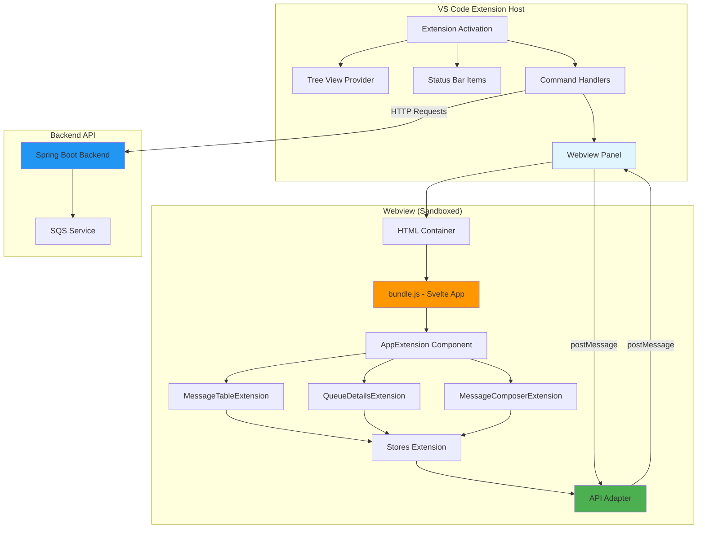
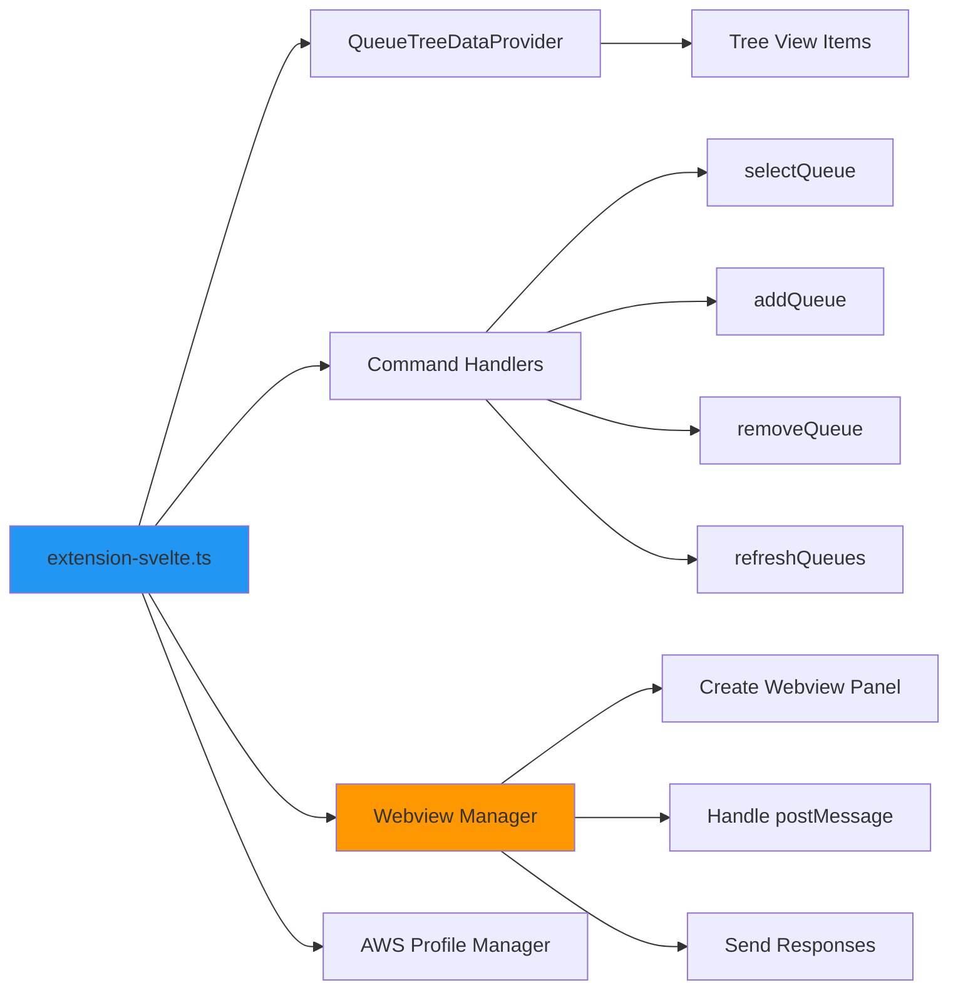
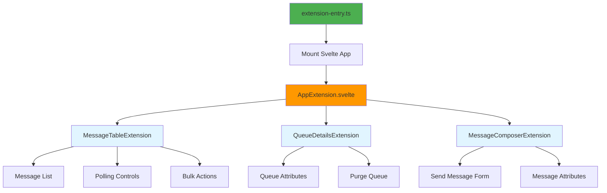
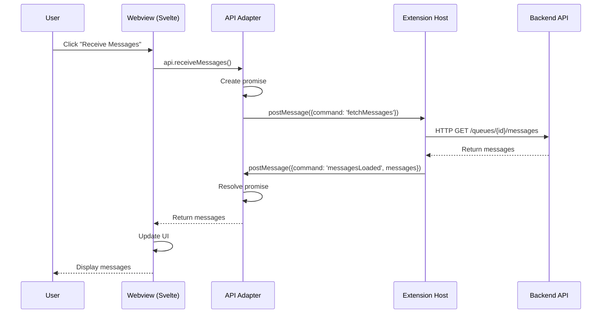
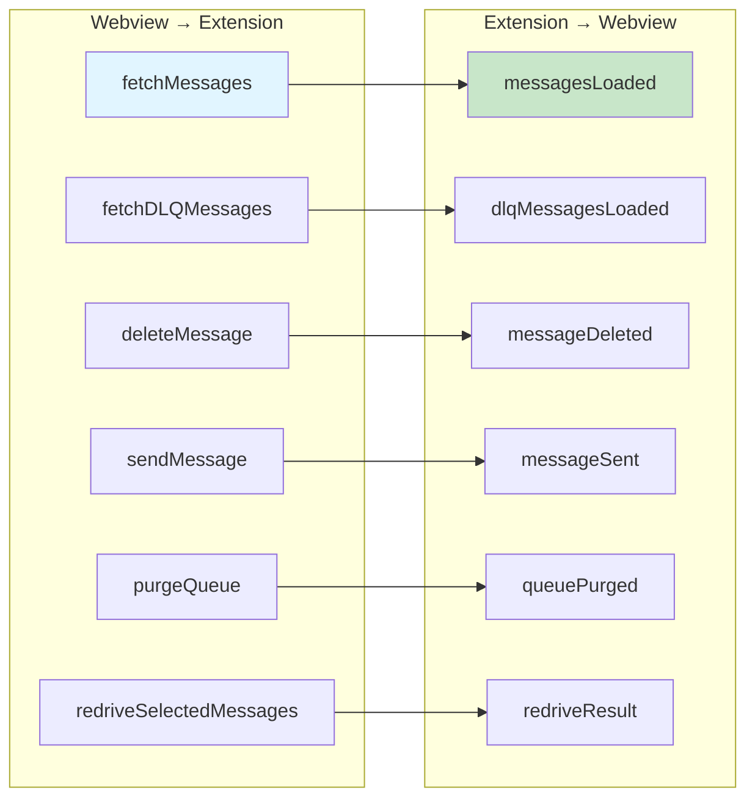
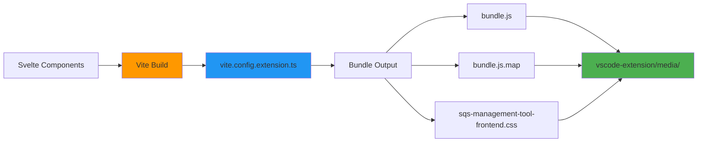
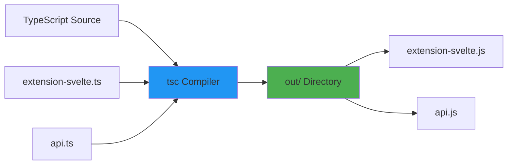
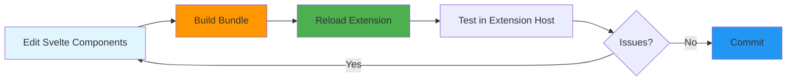

# VS Code Extension Architecture

This document explains how the SQS Management Tool VS Code extension works, including the bundled Svelte UI approach and communication patterns.

## Table of Contents

1. [Overview](#overview)
2. [Architecture Diagram](#architecture-diagram)
3. [Component Structure](#component-structure)
4. [Communication Flow](#communication-flow)
5. [Build Process](#build-process)
6. [Key Concepts](#key-concepts)
7. [Development Workflow](#development-workflow)

## Overview

The SQS Management Tool extension uses a **bundled Svelte approach** where the existing web frontend is compiled into a JavaScript bundle and loaded into VS Code webviews. This provides:

- **90%+ code reuse** from the web application
- **Full Svelte features** (reactivity, stores, components)
- **Single codebase** for both web and extension
- **Automatic theme adaptation** to VS Code's theme

## Architecture Diagram



## Component Structure

### Extension Host Components



### Webview Components



## Communication Flow

### Message Passing Architecture

VS Code webviews are sandboxed and cannot directly access Node.js APIs or make HTTP requests. All communication happens via `postMessage`.



### API Adapter Pattern

The API adapter converts HTTP-style API calls into postMessage communication:

```typescript
// In webview (api-adapter.ts)
async receiveMessages(queueId, options) {
  // Create a promise that waits for response
  const promise = waitForMessage('messagesLoaded');
  
  // Send request to extension host
  vscode.postMessage({
    command: 'fetchMessages',
    queueId,
    ...options
  });
  
  // Wait for response
  const result = await promise;
  return result.messages;
}
```

```typescript
// In extension host (extension-svelte.ts)
panel.webview.onDidReceiveMessage(async message => {
  if (message.command === 'fetchMessages') {
    // Make HTTP request to backend
    const messages = await receiveMessages(
      message.queueId,
      message.maxMessages,
      message.visibilityTimeout
    );
    
    // Send response back to webview
    panel.webview.postMessage({
      command: 'messagesLoaded',
      messages
    });
  }
});
```

### Supported Commands



## Build Process

### Frontend Build Pipeline



### Build Configuration

The extension uses a separate Vite config (`vite.config.extension.ts`) that:

1. **Entry Point**: `frontend/src/extension-entry.ts`
2. **Output Format**: IIFE (Immediately Invoked Function Expression)
3. **Output Directory**: `vscode-extension/sqs-management-tool/media/`
4. **External Dependencies**: None (everything bundled)
5. **Source Maps**: Enabled for debugging

```typescript
// vite.config.extension.ts
export default defineConfig({
  build: {
    outDir: '../vscode-extension/sqs-management-tool/media',
    emptyOutDir: false,
    rollupOptions: {
      input: './src/extension-entry.ts',
      output: {
        entryFileNames: 'bundle.js',
        format: 'iife'
      }
    }
  }
});
```

### Extension Compilation



## Key Concepts

### 1. Webview Security

VS Code webviews are sandboxed for security:

- **No direct file system access**
- **No Node.js APIs**
- **No HTTP requests** (must go through extension host)
- **Content Security Policy** (CSP) restrictions
- **Resource URIs** must be explicitly allowed

```typescript
// CSP in HTML
<meta http-equiv="Content-Security-Policy" 
      content="default-src 'none'; 
               style-src ${webview.cspSource} 'unsafe-inline'; 
               script-src 'nonce-${nonce}'; 
               connect-src https:;">
```

### 2. Resource Loading

Resources must be loaded using webview URIs:

```typescript
const scriptUri = webview.asWebviewUri(
  vscode.Uri.joinPath(context.extensionUri, 'media', 'bundle.js')
);

// Becomes: vscode-resource://extension-id/media/bundle.js
```

### 3. State Persistence

The extension uses VS Code's `globalState` for persistence:

```typescript
// Save AWS profile
await context.globalState.update('awsProfile', selectedProfile);

// Retrieve AWS profile
const profile = context.globalState.get<string>('awsProfile');
```

### 4. Theme Integration

The extension uses VS Code CSS variables for automatic theme adaptation:

```css
.container {
  background: var(--vscode-editor-background);
  color: var(--vscode-editor-foreground);
  border: 1px solid var(--vscode-panel-border);
}

.button {
  background: var(--vscode-button-background);
  color: var(--vscode-button-foreground);
}
```

### 5. Svelte 5 Compatibility

The extension uses Svelte 5's `mount()` API:

```typescript
// ✅ Correct (Svelte 5)
import { mount } from 'svelte';
const app = mount(AppExtension, { target: appElement });

// ❌ Wrong (Svelte 4)
const app = new AppExtension({ target: appElement });
```

## Development Workflow

### Setup

```bash
# Install dependencies
cd frontend && npm install
cd ../vscode-extension/sqs-management-tool && npm install

# Build frontend bundle
cd frontend
npm run build:extension

# Compile extension
cd ../vscode-extension/sqs-management-tool
npm run compile
```

### Development Cycle



### Testing

1. **Press F5** in VS Code to launch Extension Development Host
2. **Open SQS Management Tool** view in Explorer sidebar
3. **Select a queue** from the tree view
4. **Test functionality** in the webview panel
5. **Check browser console** for errors (Help → Toggle Developer Tools)

### Debugging

**Extension Host (TypeScript):**
- Set breakpoints in `extension-svelte.ts`
- Use VS Code debugger (F5)
- View logs in Debug Console

**Webview (Svelte):**
- Open Developer Tools (Help → Toggle Developer Tools)
- Use browser console for logs
- Inspect elements and network requests
- Source maps enabled for debugging

### Hot Reload

The extension does NOT support hot reload. After changes:

1. **Rebuild bundle**: `npm run build:extension` (in frontend/)
2. **Reload extension**: Press `Ctrl+R` (or `Cmd+R` on Mac) in Extension Development Host

## File Structure

```
vscode-extension/sqs-management-tool/
├── src/
│   ├── extension-svelte.ts      # Main extension entry point
│   ├── api.ts                   # Backend API client
│   └── ...
├── media/
│   ├── bundle.js                # Compiled Svelte app
│   ├── bundle.js.map            # Source maps
│   └── sqs-management-tool-frontend.css
├── out/                         # Compiled TypeScript
├── package.json                 # Extension manifest
└── tsconfig.json

frontend/
├── src/
│   ├── extension-entry.ts       # Webview entry point
│   ├── AppExtension.svelte      # Main app component
│   ├── lib/
│   │   ├── api-adapter.ts       # postMessage adapter
│   │   ├── stores-extension.svelte.ts
│   │   └── components/
│   │       ├── MessageTableExtension.svelte
│   │       ├── QueueDetailsExtension.svelte
│   │       └── MessageComposerExtension.svelte
│   └── ...
├── vite.config.extension.ts     # Extension build config
└── package.json
```

## Common Patterns

### Adding a New Command

1. **Register command** in `extension-svelte.ts`:
```typescript
context.subscriptions.push(
  vscode.commands.registerCommand('sqs-management-tool.myCommand', async () => {
    // Command logic
  })
);
```

2. **Add to package.json**:
```json
{
  "contributes": {
    "commands": [
      {
        "command": "sqs-management-tool.myCommand",
        "title": "My Command"
      }
    ]
  }
}
```

### Adding a New API Call

1. **Add to api-adapter.ts** (webview):
```typescript
async myNewApi(param: string): Promise<Result> {
  const promise = waitForMessage<Result>('myApiResult');
  vscode.postMessage({ command: 'myApi', param });
  return await promise;
}
```

2. **Handle in extension-svelte.ts** (extension host):
```typescript
case 'myApi':
  try {
    const result = await backendApi.myEndpoint(message.param);
    panel.webview.postMessage({
      command: 'myApiResult',
      result
    });
  } catch (error) {
    panel.webview.postMessage({
      command: 'myApiResult',
      error: error.message
    });
  }
  break;
```

### Adding a New Component

1. **Create component** in `frontend/src/lib/components/`:
```svelte
<!-- MyComponentExtension.svelte -->
<script lang="ts">
  import { store } from "../stores-extension.svelte";
  import { api } from "../api-adapter";
  
  // Component logic
</script>

<div class="my-component">
  <!-- Component template -->
</div>

<style>
  .my-component {
    background: var(--vscode-editor-background);
    color: var(--vscode-editor-foreground);
  }
</style>
```

2. **Import in AppExtension.svelte**:
```svelte
<script lang="ts">
  import MyComponentExtension from './lib/components/MyComponentExtension.svelte';
</script>

<MyComponentExtension />
```

3. **Rebuild bundle**: `npm run build:extension`

## Troubleshooting

### Bundle not loading

- Check that `bundle.js` exists in `vscode-extension/sqs-management-tool/media/`
- Verify CSP allows script loading
- Check browser console for errors

### postMessage not working

- Ensure command names match between webview and extension
- Check that `window.vscode` is available
- Verify message handlers are registered

### Styles not applying

- Check that CSS file is generated and loaded
- Verify VS Code theme variables are used
- Inspect elements in Developer Tools

### Extension not activating

- Check `activationEvents` in package.json
- Verify extension is compiled (`npm run compile`)
- Check Extension Host logs for errors

## Performance Considerations

- **Bundle size**: 211 KB (gzipped: 40 KB) - acceptable for extension
- **Load time**: ~100-200ms for initial webview creation
- **Memory**: ~10-20 MB per webview panel
- **Reactivity**: Svelte's fine-grained reactivity keeps updates fast

## Security Best Practices

1. **Validate all inputs** from webview before making API calls
2. **Sanitize data** before sending to webview
3. **Use nonces** for inline scripts and styles
4. **Restrict CSP** to minimum required permissions
5. **Never expose sensitive data** (API keys, credentials) to webview

## Further Reading

- [VS Code Extension API](https://code.visualstudio.com/api)
- [Webview API](https://code.visualstudio.com/api/extension-guides/webview)
- [Svelte Documentation](https://svelte.dev/docs)
- [Vite Documentation](https://vitejs.dev/)
