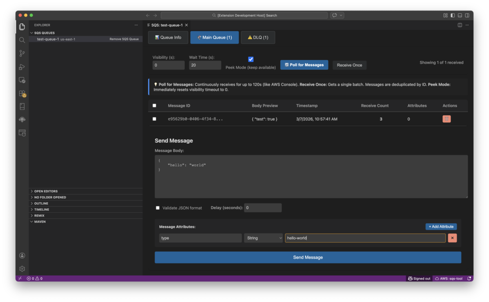

# VS Code Extension Publishing Guide

## Complete Step-by-Step Process

This guide walks you through publishing your SQS Management Tool extension to the VS Code Marketplace.

---

## Prerequisites Checklist

Before you start, ensure you have:

- [ ] A Microsoft account (for Azure DevOps)
- [ ] Node.js and pnpm installed
- [ ] Extension fully tested and working
- [ ] All documentation complete
- [ ] README.md with screenshots/GIFs
- [ ] CHANGELOG.md with version history
- [ ] LICENSE file
- [ ] Icon for the extension (128x128 PNG)

---

## Phase 1: Prepare Your Extension

### Step 1.1: Update package.json Metadata

Your current `package.json` needs several updates before publishing:

```json
{
  "name": "sqs-management-tool",
  "displayName": "AWS SQS Management Tool",
  "description": "Manage AWS SQS queues directly from VS Code. Send, receive, and monitor messages without leaving your IDE.",
  "version": "1.0.0",
  "publisher": "YOUR-PUBLISHER-NAME",  // ← ADD THIS
  "author": {
    "name": "Your Name",
    "email": "your.email@example.com"
  },
  "license": "MIT",  // ← ADD THIS
  "repository": {
    "type": "git",
    "url": "https://github.com/your-username/sqs-management-tool"
  },
  "bugs": {
    "url": "https://github.com/your-username/sqs-management-tool/issues"
  },
  "homepage": "https://github.com/your-username/sqs-management-tool#readme",
  "icon": "images/icon.png",  // ← ADD THIS
  "galleryBanner": {
    "color": "#232F3E",  // AWS dark blue
    "theme": "dark"
  },
  "keywords": [
    "aws",
    "sqs",
    "queue",
    "message queue",
    "amazon",
    "cloud",
    "devops"
  ],
  "categories": [
    "Other",
    "Azure"  // For cloud-related extensions
  ],
  "engines": {
    "vscode": "^1.88.0"
  }
}
```

**Required Changes:**
1. Add `publisher` field (you'll create this in Step 2)
2. Add `author` information
3. Add `license` field
4. Add `repository`, `bugs`, `homepage` URLs
5. Add `icon` path (create icon in Step 1.3)
6. Add `keywords` for discoverability
7. Update `categories` to be more specific
8. Consider updating `displayName` to be more descriptive

### Step 1.2: Create Required Files

#### Create LICENSE File

```bash
# In vscode-extension/sqs-management-tool/
touch LICENSE
```

Add your license text (MIT example):
```
MIT License

Copyright (c) 2024 [Your Name]

Permission is hereby granted, free of charge, to any person obtaining a copy
of this software and associated documentation files (the "Software"), to deal
in the Software without restriction...
```

#### Create CHANGELOG.md

```bash
touch CHANGELOG.md
```

```markdown
# Change Log

All notable changes to the "AWS SQS Management Tool" extension will be documented in this file.

## [1.0.0] - 2024-03-07

### Added
- Initial release
- Direct AWS SQS integration without backend
- Queue management (add, remove, refresh)
- Message operations (send, receive, delete, change visibility)
- DLQ redrive functionality with progress tracking
- Multi-region support
- AWS profile selection
- Secure credential storage
- Message attributes support (all 7 AWS SQS data types)
- Import/export queue configurations
- Queue auto-discovery

### Features
- Support for Standard and FIFO queues
- Dead Letter Queue detection and management
- Real-time message polling
- JSON validation for message bodies
- Comprehensive error handling
- Minimal IAM permissions support

## [Unreleased]
- Future enhancements will be listed here
```

### Step 1.3: Create Extension Icon

Create a 128x128 PNG icon:

```bash
mkdir -p images
# Add your icon.png file to images/icon.png
```

**Icon Requirements:**
- Size: 128x128 pixels
- Format: PNG
- Transparent background recommended
- Should represent AWS SQS or queuing concept
- Simple, recognizable design

**Quick Options:**
1. Design custom icon in Figma/Sketch
2. Use AWS SQS logo (check AWS branding guidelines)
3. Hire designer on Fiverr ($5-20)
4. Use icon generator tools

### Step 1.4: Add Screenshots/GIFs to README

Update your README.md with visual content:

```markdown
## Screenshots

### Queue Management


### Message Composer


### DLQ Redrive

```

**Recommended Screenshots:**
1. Queue tree view with multiple queues
2. Message composer with attributes
3. Message list view
4. DLQ redrive in action (GIF)
5. AWS profile selection

**Tools for Screenshots:**
- macOS: Cmd+Shift+4
- Windows: Snipping Tool
- GIF recording: LICEcap, Kap, or ScreenToGif

### Step 1.5: Clean Up Development Files

Create/update `.vscodeignore` to exclude unnecessary files:

```bash
# In vscode-extension/sqs-management-tool/
touch .vscodeignore
```

```
# Development files
.vscode/**
.vscode-test/**
src/**
tests/**
test-results/**
node_modules/**
out/tests/**
*.test.ts
*.spec.ts

# Build files
.gitignore
.eslintrc.json
tsconfig.json
tsconfig.e2e.json
jest.config.js
jest.setup.js

# Documentation (keep only essential)
ARCHITECTURE.md
DEBUG_REDRIVE.md
E2E_TEST_*.md
IMPLEMENTATION_SUMMARY.md
STANDALONE_*.md
TASK_*.md
TESTING.md
*.log
*.sh
*.py
docker-compose.test.yml
test-*.js

# Keep these
!README.md
!CHANGELOG.md
!LICENSE
!MANUAL_TESTING_MESSAGE_ATTRIBUTES.md
!QUICK_START_ATTRIBUTES.md
!MESSAGE_ATTRIBUTES_DOCS.md
!BODY_VS_ATTRIBUTES_EXPLAINED.md
!ATTRIBUTE_UI_EXAMPLE.md
!TROUBLESHOOTING.md
!SECURITY.md
!IAM_PERMISSIONS.md
```

---

## Phase 2: Create Publisher Account

### Step 2.1: Create Azure DevOps Organization

1. Go to https://dev.azure.com
2. Sign in with your Microsoft account (or create one)
3. Click "Create new organization"
4. Choose organization name (e.g., "your-name-extensions")
5. Select region closest to you
6. Click "Continue"

### Step 2.2: Create Personal Access Token (PAT)

1. In Azure DevOps, click your profile icon (top right)
2. Select "Personal access tokens"
3. Click "+ New Token"
4. Configure token:
   - **Name**: "VS Code Marketplace Publishing"
   - **Organization**: Select your organization
   - **Expiration**: 90 days (or custom)
   - **Scopes**: Select "Custom defined"
   - Check "Marketplace" → "Manage" (this gives publish permissions)
5. Click "Create"
6. **IMPORTANT**: Copy the token immediately and save it securely
   - You won't be able to see it again!
   - Store in password manager

### Step 2.3: Create Publisher on VS Code Marketplace

1. Go to https://marketplace.visualstudio.com/manage
2. Sign in with the same Microsoft account
3. Click "Create publisher"
4. Fill in details:
   - **Publisher ID**: Unique identifier (e.g., "your-name" or "your-company")
     - This will be in your extension URL
     - Cannot be changed later!
     - Must be lowercase, alphanumeric, hyphens only
   - **Publisher Name**: Display name (e.g., "Your Name")
   - **Email**: Your contact email
5. Click "Create"

**Your publisher ID** is what goes in `package.json` under `"publisher"`.

---

## Phase 3: Install Publishing Tools

### Step 3.1: Install vsce (VS Code Extension Manager)

```bash
# Install globally
npm install -g @vscode/vsce

# Or with pnpm
pnpm add -g @vscode/vsce

# Verify installation
vsce --version
```

### Step 3.2: Login to Publisher Account

```bash
# Navigate to extension directory
cd vscode-extension/sqs-management-tool

# Login with your PAT
vsce login YOUR-PUBLISHER-ID

# When prompted, paste your Personal Access Token
```

---

## Phase 4: Package and Test

### Step 4.1: Update package.json with Publisher

```json
{
  "publisher": "your-publisher-id",  // From Step 2.3
  "version": "1.0.0"
}
```

### Step 4.2: Build the Extension

```bash
# Clean previous builds
rm -rf out/
rm -f *.vsix

# Compile TypeScript
pnpm run compile

# Build frontend bundle
cd ../../frontend
pnpm run build:extension
cd ../vscode-extension/sqs-management-tool
```

### Step 4.3: Package the Extension

```bash
# Create .vsix package
vsce package

# This creates: sqs-management-tool-1.0.0.vsix
```

**Common Errors and Fixes:**

**Error: "Missing publisher name"**
```bash
# Fix: Add publisher to package.json
```

**Error: "Missing README.md"**
```bash
# Fix: Ensure README.md exists and has content
```

**Error: "Missing LICENSE"**
```bash
# Fix: Add LICENSE file
```

**Error: "Icon not found"**
```bash
# Fix: Create images/icon.png or remove icon field from package.json
```

### Step 4.4: Test the Packaged Extension

```bash
# Install the .vsix file locally
code --install-extension sqs-management-tool-1.0.0.vsix

# Test thoroughly:
# 1. Open VS Code
# 2. Verify extension appears in Extensions view
# 3. Test all features
# 4. Check for errors in Developer Tools (Help → Toggle Developer Tools)
```

**Testing Checklist:**
- [ ] Extension activates without errors
- [ ] All commands work
- [ ] Webview loads correctly
- [ ] AWS credentials can be configured
- [ ] Queues can be added/removed
- [ ] Messages can be sent/received
- [ ] No console errors
- [ ] Icon displays correctly
- [ ] README displays correctly in Extensions view

---

## Phase 5: Publish to Marketplace

### Step 5.1: Publish the Extension

```bash
# Publish to marketplace
vsce publish

# Or publish specific version
vsce publish 1.0.0

# Or publish with patch/minor/major bump
vsce publish patch  # 1.0.0 → 1.0.1
vsce publish minor  # 1.0.0 → 1.1.0
vsce publish major  # 1.0.0 → 2.0.0
```

**What happens:**
1. Extension is uploaded to marketplace
2. Automated validation runs
3. Extension goes through review (usually 1-2 hours)
4. You'll receive email when published

### Step 5.2: Monitor Publication Status

1. Go to https://marketplace.visualstudio.com/manage
2. Click on your publisher
3. View your extension status
4. Check for any validation errors

**Possible Statuses:**
- **Validating**: Automated checks running
- **Published**: Live on marketplace! 🎉
- **Unpublished**: Validation failed (check errors)

---

## Phase 6: Post-Publication

### Step 6.1: Verify Extension is Live

1. Go to https://marketplace.visualstudio.com/
2. Search for "AWS SQS Management Tool"
3. Verify:
   - Extension appears in search
   - Icon displays correctly
   - README renders properly
   - Install button works
   - Screenshots/GIFs display

### Step 6.2: Install from Marketplace

```bash
# Uninstall local version first
code --uninstall-extension YOUR-PUBLISHER-ID.sqs-management-tool

# Install from marketplace
code --install-extension YOUR-PUBLISHER-ID.sqs-management-tool
```

Or in VS Code:
1. Open Extensions view (Cmd/Ctrl+Shift+X)
2. Search for "AWS SQS Management Tool"
3. Click "Install"

### Step 6.3: Share Your Extension

**Update README.md with marketplace link:**
```markdown
## Installation

Install from the [VS Code Marketplace](https://marketplace.visualstudio.com/items?itemName=YOUR-PUBLISHER-ID.sqs-management-tool)

Or search for "AWS SQS Management Tool" in VS Code Extensions.
```

**Share on:**
- GitHub repository
- Twitter/LinkedIn
- Reddit (r/vscode, r/aws)
- Dev.to blog post
- Your website/portfolio

---

## Phase 7: Maintenance and Updates

### Publishing Updates

```bash
# 1. Make your changes
# 2. Update CHANGELOG.md
# 3. Bump version in package.json
# 4. Build and test
pnpm run compile
vsce package

# 5. Test the .vsix locally
code --install-extension sqs-management-tool-1.0.1.vsix

# 6. Publish update
vsce publish
```

### Version Numbering (Semantic Versioning)

- **Patch** (1.0.0 → 1.0.1): Bug fixes, minor changes
- **Minor** (1.0.0 → 1.1.0): New features, backward compatible
- **Major** (1.0.0 → 2.0.0): Breaking changes

### Unpublishing (if needed)

```bash
# Unpublish specific version
vsce unpublish YOUR-PUBLISHER-ID.sqs-management-tool@1.0.0

# Unpublish entire extension
vsce unpublish YOUR-PUBLISHER-ID.sqs-management-tool
```

**Warning**: Unpublishing removes extension from marketplace. Users who installed it will keep it, but can't reinstall.

---

## Troubleshooting

### "ERROR: Failed to execute 'vsce package'"

**Cause**: Missing dependencies or build errors

**Fix**:
```bash
# Clean and rebuild
rm -rf node_modules out
pnpm install
pnpm run compile
```

### "ERROR: Extension size exceeds 50MB"

**Cause**: Package includes too many files

**Fix**:
1. Check `.vscodeignore` is properly configured
2. Remove `node_modules` from package:
   ```bash
   # Add to .vscodeignore
   node_modules/**
   ```
3. Use `--no-dependencies` flag:
   ```bash
   vsce package --no-dependencies
   ```

### "ERROR: Marketplace validation failed"

**Cause**: Extension doesn't meet marketplace requirements

**Fix**:
1. Check validation errors in marketplace dashboard
2. Common issues:
   - Missing README
   - Missing LICENSE
   - Invalid icon
   - Broken links in README
   - Security vulnerabilities in dependencies

### "Extension not appearing in search"

**Cause**: Indexing delay or poor keywords

**Fix**:
1. Wait 1-2 hours for indexing
2. Improve keywords in package.json
3. Add more descriptive content to README

---

## Best Practices

### Before Publishing

- [ ] Test extension thoroughly on clean VS Code install
- [ ] Test on different operating systems (Windows, macOS, Linux)
- [ ] Run all automated tests
- [ ] Check for security vulnerabilities: `pnpm audit`
- [ ] Verify all links in README work
- [ ] Spell-check all documentation
- [ ] Test with different VS Code themes

### Documentation

- [ ] Clear, concise README with examples
- [ ] Screenshots showing key features
- [ ] GIFs demonstrating workflows
- [ ] Troubleshooting section
- [ ] Link to GitHub issues for support

### Marketing

- [ ] Choose descriptive, searchable name
- [ ] Use relevant keywords
- [ ] Create compelling description
- [ ] Professional icon
- [ ] Highlight unique features

---

## Quick Reference Commands

```bash
# Login
vsce login YOUR-PUBLISHER-ID

# Package
vsce package

# Publish
vsce publish

# Publish with version bump
vsce publish patch
vsce publish minor
vsce publish major

# Show extension info
vsce show YOUR-PUBLISHER-ID.sqs-management-tool

# List all versions
vsce ls YOUR-PUBLISHER-ID.sqs-management-tool

# Unpublish
vsce unpublish YOUR-PUBLISHER-ID.sqs-management-tool@1.0.0
```

---

## Resources

- **VS Code Publishing Docs**: https://code.visualstudio.com/api/working-with-extensions/publishing-extension
- **Marketplace Management**: https://marketplace.visualstudio.com/manage
- **Azure DevOps**: https://dev.azure.com
- **vsce Documentation**: https://github.com/microsoft/vscode-vsce
- **Extension Guidelines**: https://code.visualstudio.com/api/references/extension-guidelines

---

## Next Steps

1. Complete Phase 1 (Prepare Extension)
2. Create publisher account (Phase 2)
3. Package and test locally (Phase 4)
4. Publish to marketplace (Phase 5)
5. Monitor and maintain (Phase 7)

Good luck with your extension! 🚀
