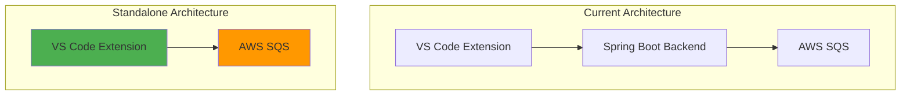
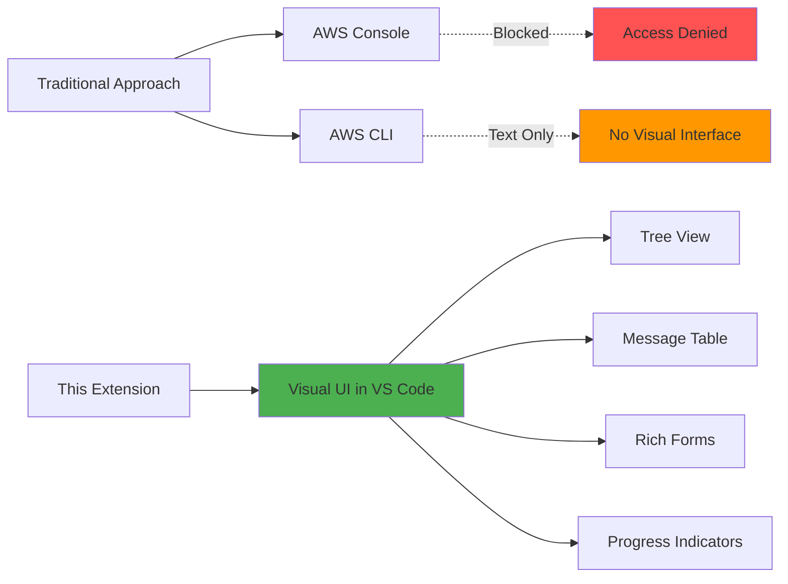
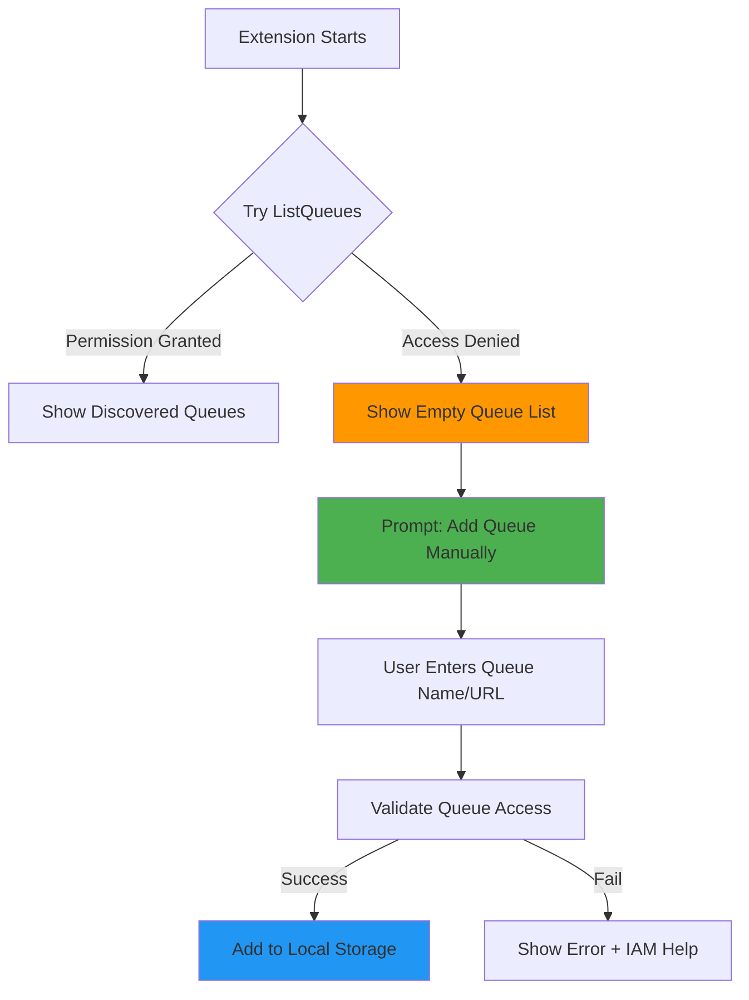
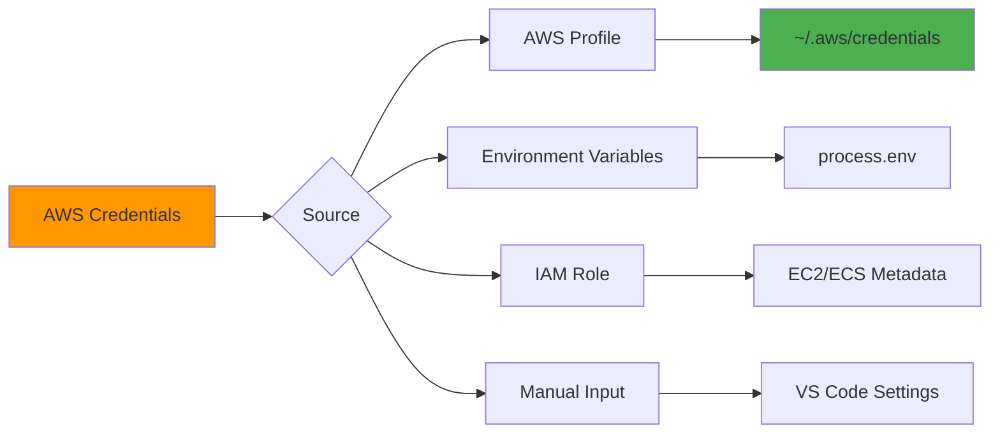
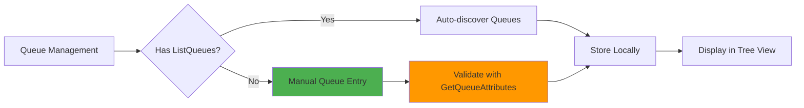
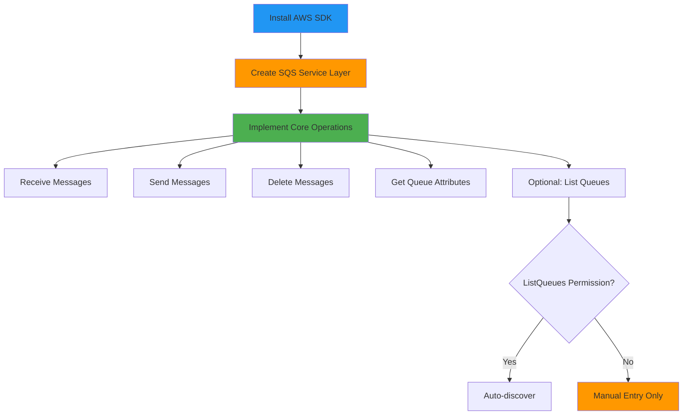
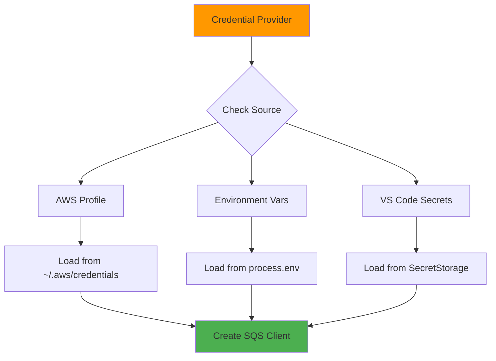
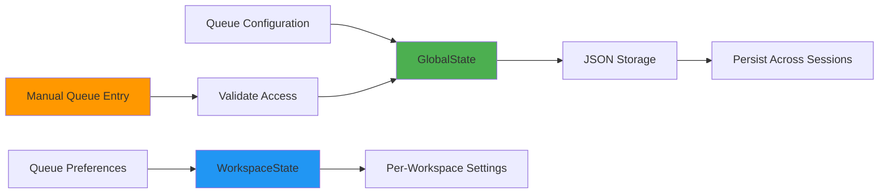
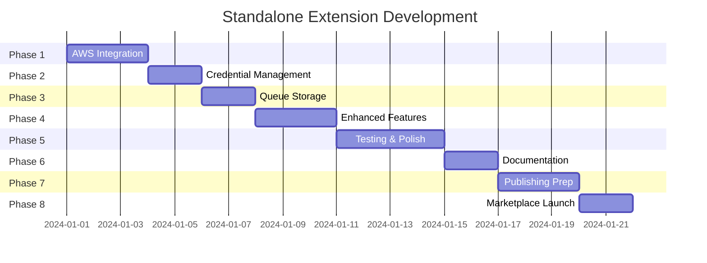

# Standalone VS Code Extension Plan

## Overview

Transform the current backend-dependent extension into a **standalone extension** that communicates directly with AWS SQS, eliminating the need for the Spring Boot backend.

## Problem Statement

Many developers face these challenges in restrictive AWS environments:

1. **No AWS Console Access** - Security policies prevent direct console access
2. **No ListQueues Permission** - IAM policies deny queue discovery for security
3. **Shared AWS Accounts** - Multiple teams share accounts with limited permissions
4. **Need Visual Management** - CLI tools exist but lack visual interface
5. **Context Switching** - Having to leave IDE to manage queues breaks flow

**This extension solves all these problems** by providing a visual, IDE-integrated SQS management tool that works with minimal IAM permissions.

## Current vs. Standalone Architecture



## Benefits

✅ **No Backend Required** - Users don't need to run Spring Boot server
✅ **Simpler Setup** - Just install extension and configure AWS credentials
✅ **Better Performance** - Direct AWS SDK calls, no HTTP overhead
✅ **Offline Queue Management** - Manage saved queues without backend
✅ **Portable** - Works on any machine with VS Code
✅ **Publishable** - Can be published to VS Code Marketplace
✅ **Lower Resource Usage** - No Java process running
✅ **Restrictive IAM Support** - Works WITHOUT `sqs:ListQueues` permission (unique feature!)
✅ **Visual Interface** - Rich UI for users without AWS Console access
✅ **IDE Integration** - Manage queues without leaving your editor

## Key Differentiators

### 1. Works Without AWS Console Access

**Problem**: Many organizations restrict AWS Console access for security or cost reasons.

**Solution**: This extension provides a **visual, graphical interface** for SQS management directly in VS Code.



**Features for Visual Management**:
- 📊 Tree view of all your queues
- 📋 Sortable, filterable message table
- 🎨 Syntax-highlighted JSON message bodies
- 📈 Real-time polling progress bar
- 🔍 Message search and filtering
- 📝 Rich message composer with validation
- ⚡ Bulk operations with visual feedback
- 🎯 Queue metrics and statistics

### 2. Restrictive IAM Environment Support

**Problem**: Most AWS SQS extensions require `sqs:ListQueues` permission, which many organizations don't grant due to security policies.

**Solution**: This extension works by allowing users to manually add queues by name or URL, then stores them locally. No `ListQueues` permission needed!



**User Experience**:
1. Extension tries `ListQueues` (optional)
2. If denied, shows friendly message: "Add queues manually"
3. User adds queue by name or URL
4. Extension validates access with `GetQueueAttributes`
5. Queue saved locally for future use

This makes the extension **usable in restrictive corporate environments** where other tools fail!

## Comparison with Alternatives

| Feature | This Extension | AWS Console | AWS CLI | Other Extensions |
|---------|---------------|-------------|---------|------------------|
| **Visual Interface** | ✅ Rich UI | ✅ Web UI | ❌ Text only | ✅ Basic UI |
| **No Console Access Needed** | ✅ Yes | ❌ Requires access | ✅ Yes | ✅ Yes |
| **Works Without ListQueues** | ✅ Yes | ❌ No | ⚠️ Limited | ❌ No |
| **Manual Queue Entry** | ✅ By name/URL | ❌ No | ✅ By URL | ❌ No |
| **IDE Integration** | ✅ Native | ❌ Browser | ❌ Terminal | ✅ Native |
| **Message Table View** | ✅ Sortable/Filterable | ✅ Yes | ❌ No | ⚠️ Basic |
| **Syntax Highlighting** | ✅ JSON | ⚠️ Basic | ❌ No | ⚠️ Basic |
| **Bulk Operations** | ✅ Yes | ✅ Yes | ⚠️ Scripts | ⚠️ Limited |
| **Real-time Polling** | ✅ With progress | ❌ No | ❌ No | ⚠️ Basic |
| **DLQ Management** | ✅ Visual | ✅ Yes | ⚠️ Manual | ⚠️ Limited |
| **Multiple Accounts** | ✅ Yes | ⚠️ Switch | ✅ Profiles | ⚠️ Limited |
| **Offline Queue List** | ✅ Saved locally | ❌ No | ❌ No | ❌ No |
| **Setup Complexity** | ⭐ Easy | ⭐⭐⭐ Access request | ⭐⭐ Config | ⭐⭐ Config |

**Key Advantages**:
- ✅ Only tool that combines visual interface + no ListQueues requirement
- ✅ Perfect for developers without Console access
- ✅ Works in the most restrictive AWS environments
- ✅ No context switching - stay in your IDE

## Technical Approach

### 1. AWS SDK Integration

Use the **AWS SDK for JavaScript v3** in the extension host:

```typescript
import { SQSClient, ReceiveMessageCommand, SendMessageCommand } from "@aws-sdk/client-sqs";

const client = new SQSClient({
  region: "us-east-1",
  credentials: {
    accessKeyId: process.env.AWS_ACCESS_KEY_ID,
    secretAccessKey: process.env.AWS_SECRET_ACCESS_KEY
  }
});
```

### 2. Credential Management



### 3. Queue Storage

Replace database with VS Code's storage APIs:

```typescript
// Global state (persists across sessions)
await context.globalState.update('queues', queueList);

// Workspace state (per-workspace)
await context.workspaceState.update('selectedQueue', queueId);

// Secret storage (for credentials)
await context.secrets.store('aws-access-key', accessKey);
```

**Queue Discovery Strategy**:


## Implementation Plan

### Phase 1: Core AWS Integration (Week 1)

**Goal**: Replace backend API calls with direct AWS SDK calls, supporting restrictive IAM environments



**Tasks**:
- [ ] Install `@aws-sdk/client-sqs` package
- [ ] Create `src/aws/sqs-service.ts` wrapper
- [ ] Implement credential provider chain
- [ ] Replace all `api.ts` calls with AWS SDK calls
- [ ] **Add graceful ListQueues failure handling**
- [ ] **Implement manual queue addition (name or URL)**
- [ ] **Validate queue access with GetQueueAttributes**
- [ ] Add error handling and retries
- [ ] Test with real AWS account (with and without ListQueues)

**Estimated Time**: 2-3 days

### Phase 2: Credential Management (Week 1)

**Goal**: Secure and flexible credential handling



**Tasks**:
- [ ] Implement AWS profile reader
- [ ] Add credential input UI
- [ ] Use VS Code SecretStorage API
- [ ] Support IAM roles (for EC2/ECS)
- [ ] Add credential validation
- [ ] Show credential status in status bar

**Estimated Time**: 1-2 days

### Phase 3: Queue Storage (Week 2)

**Goal**: Replace SQLite database with VS Code storage, support manual queue entry



**Tasks**:
- [ ] Create queue storage service
- [ ] Migrate queue CRUD operations
- [ ] **Implement "Add Queue by Name" command**
- [ ] **Implement "Add Queue by URL" command**
- [ ] **Add queue validation (GetQueueAttributes)**
- [ ] **Show helpful error messages for access denied**
- [ ] Add import/export functionality
- [ ] Support workspace-specific queues
- [ ] Add queue search/filter
- [ ] Implement queue favorites
- [ ] **Add "Try Auto-discover" button (optional)**

**Estimated Time**: 2-3 days (increased for manual entry features)

### Phase 4: Enhanced Features (Week 2)

**Goal**: Add features that weren't possible with backend, emphasize visual management

**Tasks**:
- [ ] **Graceful handling of missing ListQueues permission**
- [ ] **User-friendly error messages for IAM issues**
- [ ] **Documentation for minimal IAM permissions**
- [ ] **Rich visual queue tree view with icons**
- [ ] **Message table with sorting, filtering, search**
- [ ] **Syntax highlighting for JSON message bodies**
- [ ] **Visual queue statistics dashboard**
- [ ] **Message preview with collapsible sections**
- [ ] Auto-discover queues (if ListQueues available)
- [ ] Support multiple AWS accounts/profiles
- [ ] Add queue metrics and monitoring
- [ ] Implement CloudWatch integration (optional)
- [ ] Add DLQ auto-discovery (if ListQueues available)
- [ ] Support cross-region queue management
- [ ] **Add "Share Queue List" feature (export/import)**
- [ ] **Visual diff for message attributes**
- [ ] **Queue health indicators (age, depth)**

**Estimated Time**: 3-4 days (increased for visual features)

### Phase 5: Testing & Polish (Week 3)

**Goal**: Ensure reliability and user experience

**Tasks**:
- [ ] Unit tests for AWS service layer
- [ ] Integration tests with LocalStack
- [ ] Error handling and user feedback
- [ ] Loading states and progress indicators
- [ ] Offline mode support
- [ ] Performance optimization

**Estimated Time**: 3-4 days

### Phase 6: Documentation (Week 3)

**Goal**: Comprehensive user and developer docs

**Tasks**:
- [ ] Update README with setup instructions
- [ ] Create AWS credential setup guide
- [ ] Add troubleshooting guide
- [ ] Document IAM permissions required
- [ ] Create video walkthrough
- [ ] Add architecture diagrams

**Estimated Time**: 1-2 days

### Phase 7: Publishing Preparation (Week 4)

**Goal**: Prepare for VS Code Marketplace

**Tasks**:
- [ ] Create publisher account
- [ ] Design extension icon and banner
- [ ] Write marketplace description
- [ ] Add screenshots and demo GIF
- [ ] Set up CI/CD for releases
- [ ] Create changelog
- [ ] Add license file
- [ ] Security audit

**Estimated Time**: 2-3 days

### Phase 8: Marketplace Publishing (Week 4)

**Goal**: Publish to VS Code Marketplace

**Tasks**:
- [ ] Package extension (`.vsix`)
- [ ] Test installation from `.vsix`
- [ ] Submit to marketplace
- [ ] Monitor initial feedback
- [ ] Fix critical issues
- [ ] Announce release

**Estimated Time**: 1-2 days

## Technical Details

### AWS SDK Service Layer

```typescript
// src/aws/sqs-service.ts
import { SQSClient, ReceiveMessageCommand, SendMessageCommand, GetQueueAttributesCommand, ListQueuesCommand } from "@aws-sdk/client-sqs";

export class SQSService {
  private client: SQSClient;
  
  constructor(region: string, credentials: any) {
    this.client = new SQSClient({ region, credentials });
  }
  
  /**
   * Try to list queues - gracefully handle AccessDenied
   */
  async tryListQueues(): Promise<{ queues: string[], hasPermission: boolean }> {
    try {
      const command = new ListQueuesCommand({});
      const response = await this.client.send(command);
      return {
        queues: response.QueueUrls || [],
        hasPermission: true
      };
    } catch (error: any) {
      if (error.name === 'AccessDeniedException' || error.Code === 'AccessDenied') {
        // User doesn't have ListQueues permission - this is OK!
        return {
          queues: [],
          hasPermission: false
        };
      }
      // Other errors should be thrown
      throw error;
    }
  }
  
  /**
   * Validate queue access by getting attributes
   * This works even without ListQueues permission
   */
  async validateQueueAccess(queueUrl: string): Promise<{ valid: boolean, error?: string }> {
    try {
      const command = new GetQueueAttributesCommand({
        QueueUrl: queueUrl,
        AttributeNames: ['QueueArn', 'ApproximateNumberOfMessages']
      });
      await this.client.send(command);
      return { valid: true };
    } catch (error: any) {
      return {
        valid: false,
        error: error.message || 'Unable to access queue'
      };
    }
  }
  
  /**
   * Get queue URL from queue name
   * Requires sqs:GetQueueUrl permission (usually granted)
   */
  async getQueueUrl(queueName: string, accountId?: string): Promise<string> {
    const command = new GetQueueUrlCommand({
      QueueName: queueName,
      QueueOwnerAWSAccountId: accountId
    });
    const response = await this.client.send(command);
    return response.QueueUrl!;
  }
  
  async receiveMessages(queueUrl: string, options: ReceiveOptions) {
    const command = new ReceiveMessageCommand({
      QueueUrl: queueUrl,
      MaxNumberOfMessages: options.maxMessages,
      VisibilityTimeout: options.visibilityTimeout,
      WaitTimeSeconds: options.waitTimeSeconds,
      MessageAttributeNames: ['All'],
      AttributeNames: ['All']
    });
    
    const response = await this.client.send(command);
    return response.Messages || [];
  }
  
  async sendMessage(queueUrl: string, body: string, attributes?: any) {
    const command = new SendMessageCommand({
      QueueUrl: queueUrl,
      MessageBody: body,
      MessageAttributes: attributes
    });
    
    return await this.client.send(command);
  }
  
  // ... other methods
}
```

### Manual Queue Addition

```typescript
// src/commands/add-queue.ts
import * as vscode from 'vscode';
import { SQSService } from '../aws/sqs-service';
import { QueueStorage } from '../storage/queue-storage';

export async function addQueueCommand(
  sqsService: SQSService,
  queueStorage: QueueStorage
) {
  // Ask user how they want to add the queue
  const method = await vscode.window.showQuickPick([
    { label: 'By Queue Name', value: 'name' },
    { label: 'By Queue URL', value: 'url' }
  ], {
    placeHolder: 'How would you like to add the queue?'
  });
  
  if (!method) return;
  
  let queueUrl: string;
  let queueName: string;
  
  if (method.value === 'name') {
    // Add by name
    const name = await vscode.window.showInputBox({
      prompt: 'Enter queue name',
      placeHolder: 'my-queue-name',
      validateInput: (value) => {
        if (!value) return 'Queue name is required';
        if (!/^[a-zA-Z0-9_-]+$/.test(value)) {
          return 'Queue name can only contain letters, numbers, hyphens, and underscores';
        }
        return null;
      }
    });
    
    if (!name) return;
    
    try {
      // Try to get queue URL from name
      queueUrl = await sqsService.getQueueUrl(name);
      queueName = name;
    } catch (error: any) {
      vscode.window.showErrorMessage(
        `Failed to find queue "${name}". Make sure the queue exists and you have sqs:GetQueueUrl permission.`
      );
      return;
    }
  } else {
    // Add by URL
    const url = await vscode.window.showInputBox({
      prompt: 'Enter queue URL',
      placeHolder: 'https://sqs.us-east-1.amazonaws.com/123456789012/my-queue',
      validateInput: (value) => {
        if (!value) return 'Queue URL is required';
        if (!value.startsWith('https://sqs.')) {
          return 'Invalid queue URL format';
        }
        return null;
      }
    });
    
    if (!url) return;
    
    queueUrl = url;
    // Extract queue name from URL
    queueName = url.split('/').pop() || 'Unknown';
  }
  
  // Validate queue access
  vscode.window.withProgress({
    location: vscode.ProgressLocation.Notification,
    title: `Validating access to ${queueName}...`,
    cancellable: false
  }, async () => {
    const validation = await sqsService.validateQueueAccess(queueUrl);
    
    if (!validation.valid) {
      vscode.window.showErrorMessage(
        `Cannot access queue "${queueName}": ${validation.error}\n\n` +
        `Required IAM permissions:\n` +
        `- sqs:GetQueueAttributes\n` +
        `- sqs:ReceiveMessage\n` +
        `- sqs:SendMessage\n` +
        `- sqs:DeleteMessage`
      );
      return;
    }
    
    // Add to storage
    await queueStorage.addQueue({
      id: crypto.randomUUID(),
      name: queueName,
      url: queueUrl,
      region: extractRegion(queueUrl),
      addedManually: true
    });
    
    vscode.window.showInformationMessage(
      `✅ Queue "${queueName}" added successfully!`
    );
  });
}

function extractRegion(queueUrl: string): string {
  const match = queueUrl.match(/sqs\.([^.]+)\.amazonaws\.com/);
  return match ? match[1] : 'us-east-1';
}
```

### Extension Activation with ListQueues Fallback

```typescript
// src/extension.ts
export async function activate(context: vscode.ExtensionContext) {
  const sqsService = new SQSService(region, credentials);
  const queueStorage = new QueueStorage(context);
  
  // Try to auto-discover queues (optional)
  const { queues, hasPermission } = await sqsService.tryListQueues();
  
  if (!hasPermission) {
    // Show helpful message
    vscode.window.showInformationMessage(
      'AWS SQS: ListQueues permission not available. You can add queues manually.',
      'Add Queue',
      'Learn More'
    ).then(selection => {
      if (selection === 'Add Queue') {
        vscode.commands.executeCommand('sqs-management-tool.addQueue');
      } else if (selection === 'Learn More') {
        vscode.env.openExternal(vscode.Uri.parse(
          'https://github.com/your-repo/wiki/Minimal-IAM-Permissions'
        ));
      }
    });
  } else if (queues.length > 0) {
    // Auto-discovered queues - offer to import
    vscode.window.showInformationMessage(
      `Found ${queues.length} queue(s). Import them?`,
      'Import All',
      'Select Queues'
    ).then(async selection => {
      if (selection === 'Import All') {
        for (const queueUrl of queues) {
          await queueStorage.addQueue({
            id: crypto.randomUUID(),
            name: queueUrl.split('/').pop()!,
            url: queueUrl,
            region: extractRegion(queueUrl),
            addedManually: false
          });
        }
      }
    });
  }
  
  // Register commands
  context.subscriptions.push(
    vscode.commands.registerCommand(
      'sqs-management-tool.addQueue',
      () => addQueueCommand(sqsService, queueStorage)
    )
  );
  
  // ... rest of activation
}
```

### Credential Provider

```typescript
// src/aws/credentials.ts
import { fromIni } from "@aws-sdk/credential-providers";
import * as vscode from 'vscode';

export class CredentialProvider {
  async getCredentials(profile?: string) {
    // 1. Try AWS profile
    if (profile) {
      return fromIni({ profile });
    }
    
    // 2. Try environment variables
    if (process.env.AWS_ACCESS_KEY_ID) {
      return {
        accessKeyId: process.env.AWS_ACCESS_KEY_ID,
        secretAccessKey: process.env.AWS_SECRET_ACCESS_KEY!
      };
    }
    
    // 3. Try VS Code secrets
    const accessKey = await vscode.secrets.get('aws-access-key');
    const secretKey = await vscode.secrets.get('aws-secret-key');
    if (accessKey && secretKey) {
      return { accessKeyId: accessKey, secretAccessKey: secretKey };
    }
    
    // 4. Prompt user
    return await this.promptForCredentials();
  }
  
  private async promptForCredentials() {
    const accessKey = await vscode.window.showInputBox({
      prompt: 'Enter AWS Access Key ID',
      password: false
    });
    
    const secretKey = await vscode.window.showInputBox({
      prompt: 'Enter AWS Secret Access Key',
      password: true
    });
    
    if (accessKey && secretKey) {
      // Store in secrets
      await vscode.secrets.store('aws-access-key', accessKey);
      await vscode.secrets.store('aws-secret-key', secretKey);
      
      return { accessKeyId: accessKey, secretAccessKey: secretKey };
    }
    
    throw new Error('AWS credentials required');
  }
}
```

### Queue Storage

```typescript
// src/storage/queue-storage.ts
import * as vscode from 'vscode';

export interface QueueConfig {
  id: string;
  name: string;
  url: string;
  region: string;
  dlqUrl?: string;
  tags?: string[];
  favorite?: boolean;
}

export class QueueStorage {
  constructor(private context: vscode.ExtensionContext) {}
  
  async getQueues(): Promise<QueueConfig[]> {
    return this.context.globalState.get('queues', []);
  }
  
  async addQueue(queue: QueueConfig): Promise<void> {
    const queues = await this.getQueues();
    queues.push(queue);
    await this.context.globalState.update('queues', queues);
  }
  
  async removeQueue(id: string): Promise<void> {
    const queues = await this.getQueues();
    const filtered = queues.filter(q => q.id !== id);
    await this.context.globalState.update('queues', filtered);
  }
  
  async updateQueue(id: string, updates: Partial<QueueConfig>): Promise<void> {
    const queues = await this.getQueues();
    const index = queues.findIndex(q => q.id === id);
    if (index >= 0) {
      queues[index] = { ...queues[index], ...updates };
      await this.context.globalState.update('queues', queues);
    }
  }
  
  // Import/Export
  async exportQueues(): Promise<string> {
    const queues = await this.getQueues();
    return JSON.stringify(queues, null, 2);
  }
  
  async importQueues(json: string): Promise<void> {
    const queues = JSON.parse(json);
    await this.context.globalState.update('queues', queues);
  }
}
```

## Package Dependencies

```json
{
  "dependencies": {
    "@aws-sdk/client-sqs": "^3.x.x",
    "@aws-sdk/credential-providers": "^3.x.x"
  },
  "devDependencies": {
    "@types/vscode": "^1.80.0",
    "vsce": "^2.x.x"
  }
}
```

## IAM Permissions Required

### Minimal Permissions (Works WITHOUT ListQueues!)

This is the **minimum** set of permissions needed for the extension to work:

```json
{
  "Version": "2012-10-17",
  "Statement": [
    {
      "Effect": "Allow",
      "Action": [
        "sqs:GetQueueUrl",
        "sqs:GetQueueAttributes",
        "sqs:ReceiveMessage",
        "sqs:SendMessage",
        "sqs:DeleteMessage",
        "sqs:ChangeMessageVisibility"
      ],
      "Resource": "arn:aws:sqs:*:*:*"
    }
  ]
}
```

**Note**: `sqs:ListQueues` is **NOT required**! Users can add queues manually by name or URL.

### Optional Permissions (Enhanced Features)

For auto-discovery and additional features:

```json
{
  "Version": "2012-10-17",
  "Statement": [
    {
      "Effect": "Allow",
      "Action": [
        "sqs:ListQueues",
        "sqs:PurgeQueue",
        "sqs:SetQueueAttributes"
      ],
      "Resource": "*"
    }
  ]
}
```

### Permission Comparison

| Feature | Required Permission | Fallback if Missing |
|---------|-------------------|---------------------|
| Add queue by name | `sqs:GetQueueUrl` | Add by URL instead |
| Add queue by URL | `sqs:GetQueueAttributes` | None - required |
| Auto-discover queues | `sqs:ListQueues` | Manual entry |
| Receive messages | `sqs:ReceiveMessage` | None - required |
| Send messages | `sqs:SendMessage` | None - required |
| Delete messages | `sqs:DeleteMessage` | None - required |
| Purge queue | `sqs:PurgeQueue` | Feature disabled |

### Restrictive Environment Example

Many organizations use policies like this:

```json
{
  "Version": "2012-10-17",
  "Statement": [
    {
      "Effect": "Allow",
      "Action": [
        "sqs:GetQueueUrl",
        "sqs:GetQueueAttributes",
        "sqs:ReceiveMessage",
        "sqs:SendMessage",
        "sqs:DeleteMessage"
      ],
      "Resource": "arn:aws:sqs:us-east-1:123456789012:my-team-*"
    },
    {
      "Effect": "Deny",
      "Action": "sqs:ListQueues",
      "Resource": "*"
    }
  ]
}
```

**This extension works perfectly with such policies!** Users just need to know their queue names.

## Publishing to VS Code Marketplace

### Prerequisites

1. **Create Publisher Account**
   - Go to https://marketplace.visualstudio.com/manage
   - Sign in with Microsoft account
   - Create publisher ID

2. **Get Personal Access Token**
   - Go to Azure DevOps
   - Create PAT with "Marketplace (Manage)" scope

3. **Install vsce**
   ```bash
   npm install -g @vscode/vsce
   ```

### Publishing Steps


1. **Update package.json**
   ```json
   {
     "name": "sqs-management-tool",
     "displayName": "AWS SQS Management Tool",
     "description": "Manage AWS SQS queues directly from VS Code",
     "version": "1.0.0",
     "publisher": "your-publisher-id",
     "icon": "images/icon.png",
     "repository": {
       "type": "git",
       "url": "https://github.com/your-username/sqs-tools"
     },
     "keywords": ["aws", "sqs", "queue", "messaging"],
     "categories": ["Other"],
     "engines": {
       "vscode": "^1.80.0"
     }
   }
   ```

2. **Create Icon and Banner**
   - Icon: 128x128 PNG
   - Banner: 1280x640 PNG
   - Use AWS SQS colors (orange/blue)

3. **Package Extension**
   ```bash
   vsce package
   # Creates: sqs-management-tool-1.0.0.vsix
   ```

4. **Test Installation**
   ```bash
   code --install-extension sqs-management-tool-1.0.0.vsix
   ```

5. **Publish**
   ```bash
   vsce login your-publisher-id
   vsce publish
   ```

6. **Update and Republish**
   ```bash
   # Bump version
   vsce publish patch  # 1.0.0 -> 1.0.1
   vsce publish minor  # 1.0.0 -> 1.1.0
   vsce publish major  # 1.0.0 -> 2.0.0
   ```

## Marketing & Distribution

### Marketplace Listing

**Title**: AWS SQS Management Tool

**Short Description**: 
Visual SQS management for VS Code. Perfect for restrictive AWS environments - no Console access or ListQueues permission needed!

**Long Description**:
```
AWS SQS Management Tool brings powerful queue management capabilities directly into VS Code with a rich visual interface.

🎯 PERFECT FOR RESTRICTIVE AWS ENVIRONMENTS:
✅ No AWS Console access needed - full visual UI in VS Code
✅ Works WITHOUT sqs:ListQueues permission
✅ Ideal for shared AWS accounts with limited permissions
✅ Visual alternative to AWS CLI

Why This Extension?
Many developers work in restrictive corporate AWS environments where:
- AWS Console access is blocked for security/cost reasons
- ListQueues permission is denied
- Shared accounts have minimal IAM permissions
- CLI tools are the only option (but lack visual interface)

This extension solves these problems with a rich, visual interface right in your IDE.

Features:
✅ Manual queue addition (by name or URL) - no ListQueues needed
✅ Visual tree view of your queues
✅ Rich message table with sorting and filtering
✅ Syntax-highlighted JSON message viewer
✅ Real-time polling with progress indicators
✅ Message composer with validation
✅ Bulk operations (delete, redrive)
✅ Dead Letter Queue (DLQ) management
✅ Multiple AWS account support
✅ Dark/Light theme integration
✅ Secure credential management
✅ Optional auto-discovery (if ListQueues available)

Perfect for:
- Developers without AWS Console access
- Teams in restrictive corporate AWS environments
- Shared AWS accounts with limited IAM permissions
- Anyone who wants visual SQS management in their IDE
- Developers who prefer not to context-switch to browser

Unlike other SQS extensions that require ListQueues permission and assume Console access, this extension provides a complete visual management experience with minimal IAM permissions.

No backend required - connects directly to AWS SQS!
```

**Tags/Keywords**:
- aws
- sqs
- queue
- messaging
- restrictive-iam
- no-listqueues
- no-console-access
- visual-management
- corporate
- enterprise
- security
- shared-account
- minimal-permissions

**Screenshots**:
1. Queue list and message table
2. Polling in progress
3. Message details panel
4. Send message form
5. DLQ management

**Demo GIF**:
- Show queue selection
- Poll for messages
- View message details
- Send a message

### Promotion Channels

1. **GitHub**
   - Create releases with changelogs
   - Add badges to README
   - Create GitHub Pages site

2. **Social Media**
   - Twitter/X announcement
   - LinkedIn post
   - Reddit (r/vscode, r/aws)
   - Dev.to article

3. **AWS Community**
   - AWS Community Builders
   - AWS User Groups
   - AWS re:Post

4. **Blog Posts**
   - "Building a VS Code Extension for AWS SQS"
   - "Managing SQS Queues Without Leaving Your Editor"
   - "From Backend-Dependent to Standalone Extension"

## Maintenance Plan

### Version Strategy

- **Patch (1.0.x)**: Bug fixes, minor improvements
- **Minor (1.x.0)**: New features, non-breaking changes
- **Major (x.0.0)**: Breaking changes, major rewrites

### Support Channels

1. **GitHub Issues** - Bug reports and feature requests
2. **GitHub Discussions** - Q&A and community support
3. **Email** - Direct support for critical issues

### Monitoring

- **Marketplace Analytics** - Install count, ratings
- **GitHub Insights** - Stars, forks, issues
- **User Feedback** - Reviews and ratings

## Risk Assessment

### Technical Risks

| Risk | Impact | Mitigation |
|------|--------|------------|
| AWS SDK bundle size | High | Use tree-shaking, lazy loading |
| Credential security | Critical | Use VS Code SecretStorage, never log credentials |
| Rate limiting | Medium | Implement exponential backoff, request throttling |
| Cross-region latency | Low | Cache queue metadata, show loading states |

### Business Risks

| Risk | Impact | Mitigation |
|------|--------|------------|
| Low adoption | Medium | Strong marketing, clear value proposition |
| Negative reviews | High | Thorough testing, responsive support |
| Competition | Low | Unique features, better UX |
| AWS API changes | Medium | Pin SDK versions, monitor AWS announcements |

## Success Metrics

### Launch Goals (First 3 Months)

- 📊 **1,000+ installs**
- ⭐ **4.5+ star rating**
- 🐛 **<5 critical bugs**
- 📈 **50+ GitHub stars**
- 💬 **Active community engagement**

### Long-term Goals (First Year)

- 📊 **10,000+ installs**
- ⭐ **4.7+ star rating**
- 🔄 **Monthly active users: 5,000+**
- 🌟 **Featured on VS Code Marketplace**
- 🤝 **Community contributions**

## Timeline Summary



**Total Estimated Time**: 3-4 weeks

## Next Steps

1. ✅ Review and approve this plan
2. 🎯 Set up project tracking (GitHub Projects)
3. 🚀 Start Phase 1: AWS Integration
4. 📝 Create detailed task breakdown
5. 🔄 Set up CI/CD pipeline
6. 📢 Prepare marketing materials

## Questions to Consider

1. **Pricing**: Keep free or offer premium features?
2. **Open Source**: Keep fully open source or closed source?
3. **Branding**: Use current name or rebrand?
4. **Support**: Community-only or offer paid support?
5. **Features**: Which features are MVP vs. nice-to-have?

## Conclusion

Building a standalone extension is **highly feasible** and offers significant benefits:

- ✅ **Better user experience** (no backend setup)
- ✅ **Wider adoption** (easier to install)
- ✅ **Marketplace visibility** (discoverable by millions)
- ✅ **Direct AWS integration** (better performance)
- ✅ **Professional product** (publishable and maintainable)

The estimated timeline of **3-4 weeks** is realistic for a production-ready extension that can be published to the VS Code Marketplace.

**Recommendation**: Proceed with standalone extension development. The investment will pay off through wider adoption and a better product.
